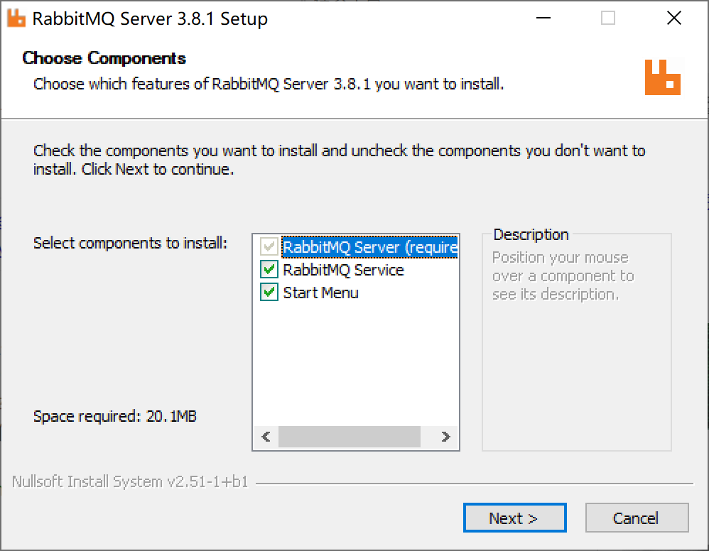

## 9.3 Spring Boot集成RabbitMQ

RabbitMQ是实现了高级消息队列协议（AMQP）的开源消息中间件，基于erlang开发，并发能力很强，性能极好，延时很低，是当前大量部署使用的消息中间件。


### 9.3.1 安装配置

到[RabbitMQ官网](http://www.rabbitmq.com/)下载最新版[rabbitmq-server-3.8.1.exe](https://github.com/rabbitmq/rabbitmq-server/releases/download/v3.8.1/rabbitmq-server-3.8.1.exe)。

安装运行RabbitMQ需要64位的Erlang，针对3.8.1版本的RabbitMQ官方推荐Erlang 22.1版本。

到[Erlang官网](https://www.erlang.org/)下载[otp_win64_22.1.exe](https://erlang.org/download/otp_win64_22.1.exe)。

#### 9.3.1.1 安装Erlang

使用默认配置安装Erlang。


#### 9.3.1.2 安装RabbitMQ

使用默认配置安装RabbitMQ。



RabbitMQ提供了Web管理界面。

打开命令提示符窗口，进入`C:\Program Files\RabbitMQ Server\rabbitmq_server-3.8.1\sbin`目录，执行`rabbitmq-plugins.bat enable rabbitmq_management` 开启Web管理插件。

```powershell
Microsoft Windows [版本 10.0.18362.476]
(c) 2019 Microsoft Corporation。保留所有权利。

C:\Users\Kevin>cd C:\Program Files\RabbitMQ Server\rabbitmq_server-3.8.1\sbin

C:\Program Files\RabbitMQ Server\rabbitmq_server-3.8.1\sbin>rabbitmq-plugins.bat enable rabbitmq_management
Enabling plugins on node rabbit@NOTEBOOK-KEVIN:
rabbitmq_management
The following plugins have been configured:
  rabbitmq_management
  rabbitmq_management_agent
  rabbitmq_web_dispatch
Applying plugin configuration to rabbit@NOTEBOOK-KEVIN...
The following plugins have been enabled:
  rabbitmq_management
  rabbitmq_management_agent
  rabbitmq_web_dispatch

started 3 plugins.

C:\Program Files\RabbitMQ Server\rabbitmq_server-3.8.1\sbin>
```

打开浏览器访问[http://localhost:15672/](http://localhost:15672/)，使用guest用户，密码guest登录管理控制台。


### 9.3.2 与Spring Boot集成

新建Spring Boot项目，选择Spring for RabbitMQ+Spring Web启动器依赖。


pom文件的主要依赖为`spring-boot-starter-amqp`。

```xml
<dependency>
    <groupId>org.springframework.boot</groupId>
    <artifactId>spring-boot-starter-amqp</artifactId>
</dependency>
<dependency>
    <groupId>org.springframework.boot</groupId>
    <artifactId>spring-boot-starter-web</artifactId>
</dependency>
```

