## 9.4 Spring Boot 集成RocketMQ

RocketMQ 是由阿里巴巴开源到 Apache 的一个 Java 语言的分布式消息中间件，支持事务消息、顺序消息、批量消息、定时消息、消息回溯等。它里面有几个区别于标准消息中件间的概念，如 Group、Topic、Queue 等。系统组成则有 Producer、Consumer、Broker、NameServer 等。

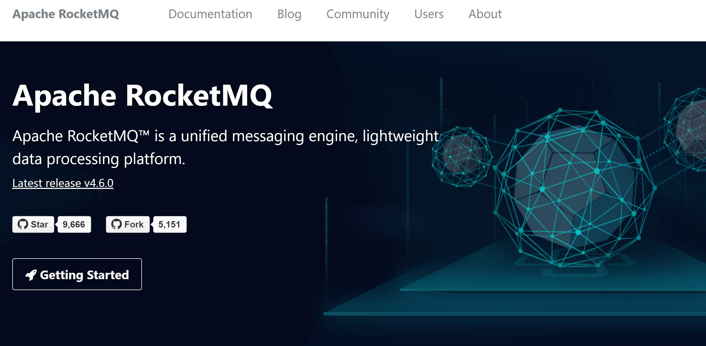

RocketMQ 的主要特点：

- 支持发布/订阅（Pub/Sub）和点对点（P2P）消息模型。
- 在一个队列中可靠的先进先出（FIFO）和严格的顺序传递 （RocketMQ可以保证严格的消息顺序，而 ActiveMQ 无法保证）。
- 支持拉（pull）和推（push）两种消息模式 （Push 好理解，比如在消费者端设置Listener回调；而 Pull，控制权在于应用，即应用需要主动的调用拉消息方法从 Broker 获取消息，这里面存在一个消费位置记录的问题（如果不记录，会导致消息重复消费））。
- 单一队列百万消息的堆积能力（RocketMQ 提供亿级消息的堆积能力，这不是重点，重点是堆积了亿级的消息后，依然保持写入低延迟）。
- 支持多种消息协议，如 JMS、MQTT 等。
- 分布式高可用的部署架构，满足至少一次消息传递语义（RocketMQ 原生就是支持分布式的，而ActiveMQ 原生存在单点性）。
- 提供 docker 镜像用于隔离测试和云集群部署。
- 提供配置、指标和监控等功能丰富的 Dashboard。

RocketMQ 以 Topic 来管理不同应用的消息，对于生产者（producer）而言，发送消息时需要指定消息的 Topic，对于消费者（consumer）而言，在启动后需要订阅相应的 Topic，然后可以消费相应的消息。Topic 是逻辑上的概念，在物理实现上，一个 Topic 由多个 Queue 组成，采用多个 Queue 的好处是可以将 Broker 存储分布式化，提高系统性能。

本小节介绍如何安装配置高可用的 RocketMQ 集群，在 Spring Boot 中集成使用。

### 9.4.1 单机安装配置

到 [官网](http://rocketmq.apache.org/) 下载最新版本 [rocketmq-all-4.6.0-bin-release.zip](https://www.apache.org/dyn/closer.cgi?path=rocketmq/4.6.0/rocketmq-all-4.6.0-bin-release.zip)，然后解压到磁盘，例如`C:\Java\rocketmq-all-4.6.0-bin-release`。

在 Windows 的环境变量中配置 ROCKETMQ_HOME 到 RocketMQ 的解压目录，例如`C:\Java\rocketmq-all-4.6.0-bin-release`。

为 RocketMQ 设置 Windows 环境变量**ROCKETMQ_HOME**，指向安装目录`C:\Java\rocketmq-all-4.6.0-bin-release`。

执行 bin 目录下的 mqnamesrv.cmd，启动 name server。

```powershell
C:\Java\rocketmq-all-4.6.0-bin-release\bin>mqnamesrv.cmd
```

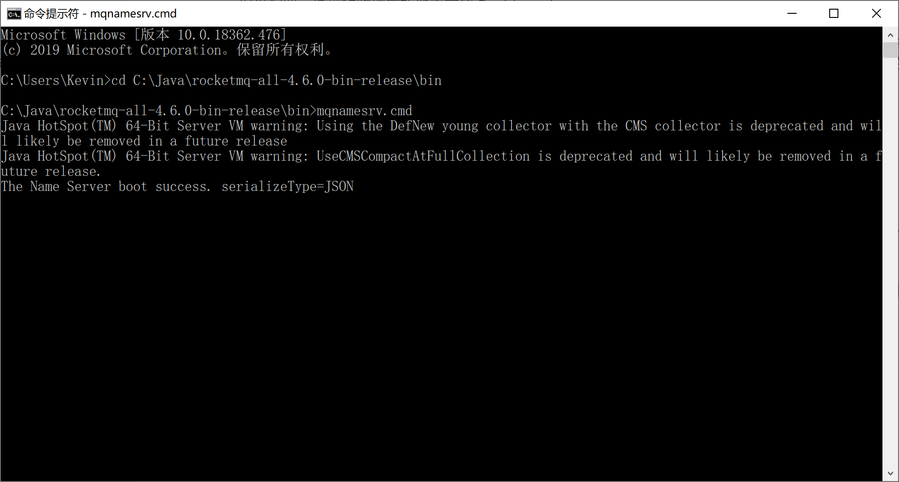

执行 bin 目录下的 mqbroker.cmd，启动 BROKER。

```powershell
C:\Java\rocketmq-all-4.6.0-bin-release\bin>mqbroker.cmd -n 127.0.0.1:9876 autoCreateTopicEnable=true
```

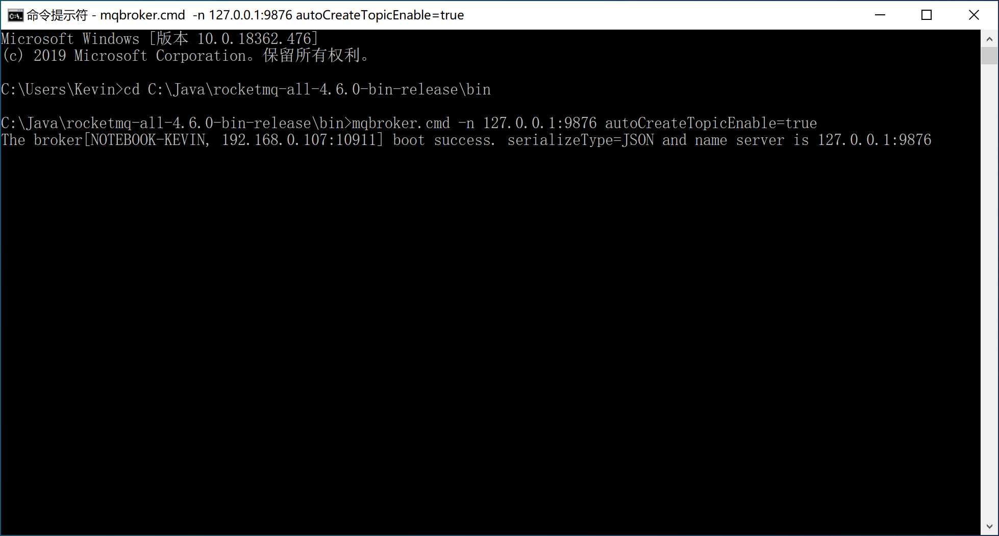

为了方便后续对 RocketMQ 的监控，可以选择安装 RocketMQ 社区提供的管理控制台。

> **[rocketmq-externals](https://github.com/apache/rocketmq-externals)**项目由社区维护了很多 RocketMQ 相关的扩展/集成支持，其中的 rocketmq-console 子项目是一个可视化的管理控制台。

执行 git clone 命令，将项目版本库克隆到本地。

```bash
git clone https://github.com/apache/rocketmq-externals.git
```

进入 rocketmq-console 子项目的目录，maven 编译。

```bash
mvn clean package -Dmaven.test.skip=true
```

进入 target 目录执行 java -jar 命令（在命令行中指定服务器端口和 RocketMQ 的 name server 地址），启动 RocketMQ 管理控制台。

```bash
java -jar rocketmq-console-ng-1.0.1.jar --server.port=80  --rocketmq.config.namesrvAddr=127.0.0.1:9876
```

打开浏览器，输入 [http://localhost/](http://localhost/) 就可以访问到RocketMQ的控制台。

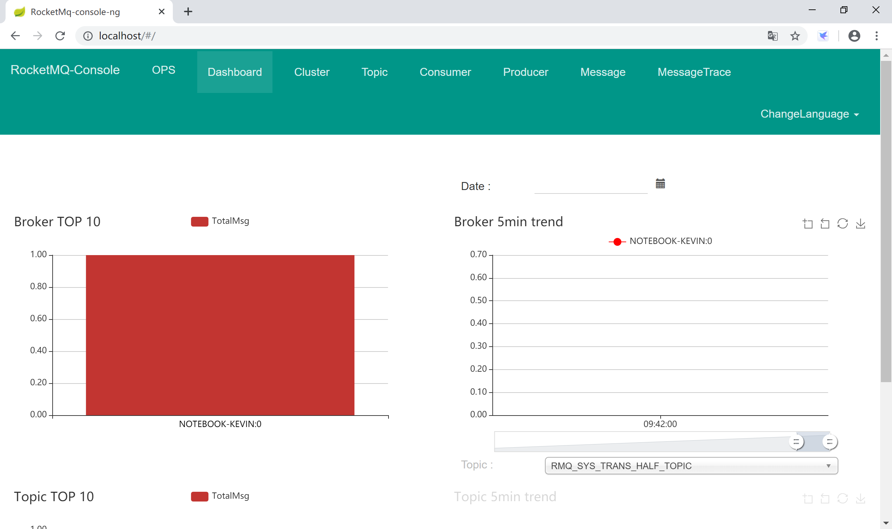

### 9.4.2 高可用集群

RocketMQ 天生对集群的支持非常友好，在其安装包的 conf 目录下就带了“2主-2从同步”和“2主-2从异步”的配置参考文件。

RocketMQ 的服务模式有如下几种：

- **单Master**
  - 优点：除了配置简单没什么优点。
  - 缺点：不可靠，该机器重启或宕机，将导致整个服务不可用。
- **多Master**
  - 优点：配置简单，性能最高。
  - 缺点：可能会有少量消息丢失（配置相关），单台机器重启或宕机期间，该机器上面未被消费的消息在机器恢复前不可订阅，影响消息实时性。
- **多Master多Slave异步模式**：每个Master配一个Slave，有多对Master-Slave，集群采用异步复制方式，主备有短暂（毫秒级）消息延迟
  - 优点：性能同多Master几乎一样，实时性高，主备间切换对应用透明，不需人工干预。
  - 缺点：Master宕机或磁盘损坏时会有少量消息丢失。
- **多Master多Slave同步模式**：每个Master配一个Slave，有多对Master-Slave，集群采用同步双写方式，主备都写成功，向应用返回成功
  - 优点：服务可用性与数据可用性非常高。
  - 缺点：性能比异步集群略低，当前版本主宕备不能自动切换为主。

下面我们以“**2namesrv-2master-2slave异步**刷盘消息队列集群”为例来讲解 RocketMQ 的集群配置，以官方发布包`rocketmq-all-4.6.0-bin-release\conf\2m-2s-async`下的参考配置文件为基础，并根据自生集群情况进行了修改。

#### 9.4.2.1 配置

六台服务器都部署在本地机器上，名称、端口信息规划如下：

| 服务器名称   | IP地址    | 端口  | 用途                |
| ------------ | --------- | ----- | ------------------- |
| nameserver-a | 127.0.0.1 | 9876  | Name Server         |
| nameserver-b | 127.0.0.1 | 9877  | Name Server         |
| broker-a     | 127.0.0.1 | 10850 | Broker Server（主） |
| broker-a-s   | 127.0.0.1 | 10880 | Broker Server（从） |
| broker-b     | 127.0.0.1 | 10950 | Broker Server（主） |
| broker-b-s   | 127.0.0.1 | 10980 | Broker Server（从） |

为两个 broker 主从服务器创建数据存储目录`\rocketmq-all-4.6.0-bin-release\data\broker-a`和`\rocketmq-all-4.6.0-bin-release\data\broker-b`，并分别在其下创建如下目录：

- store：存放 broker master 的数据；
- store\slave：存放 broker slave 的数据；
- store\commitlog：存放提交日志数据；

> **brokerIP1** 当前 broker 监听的 IP；
>
> **brokerIP2** 存在 broker 主从时，在 broker 主节点上配置了 brokerIP2 的情况下，broker 从节点会连接主节点配置的 brokerIP2 来同步。

因为是在一台机器上运行六个服务器实例（学习测试用），所以，将服务器启动脚本中jvm对内存的要求调小：

- 修改 RocketMQ bin 目录下的`runserver.cmd`，将内存修改为：`-server -Xms256m -Xmx256m -Xmn128m -XX:MetaspaceSize=128m -XX:MaxMetaspaceSize=320m`；
- 修改 RocketMQ bin 目录下的`runbroker.cmd`，将内存修改为：`-server -Xms256m -Xmx256m -Xmn128m`；

配置 Name Server A，nameserver-a.properties：

```properties
listenPort=9876
```

配置 Name Server B，nameserver-b.properties：

```properties
listenPort=9877
```

配置 broker-a master，broker-a.properties：

```properties
brokerClusterName=DefaultCluster
brokerName=broker-a
brokerId=0
deleteWhen=04
fileReservedTime=48
brokerRole=ASYNC_MASTER
flushDiskType=ASYNC_FLUSH
namesrvAddr=127.0.0.1:9876;127.0.0.1:9877
listenPort=10850
brokerIP1=127.0.0.1
brokerIP2=127.0.0.1
storePathRootDir=C:/Java/rocketmq-all-4.6.0-bin-release/data/broker-a/store
storePathCommitLog=C:/Java/rocketmq-all-4.6.0-bin-release/data/broker-a/store/commitlog
```

配置 broker-a slave，broker-a-s.properties：

```properties
brokerClusterName=DefaultCluster
brokerName=broker-a
brokerId=1
deleteWhen=04
fileReservedTime=48
brokerRole=SLAVE
flushDiskType=ASYNC_FLUSH
namesrvAddr=127.0.0.1:9876;127.0.0.1:9877
listenPort=10880
brokerIP1=127.0.0.1
storePathRootDir=C:/Java/rocketmq-all-4.6.0-bin-release/data/broker-a/store/slave
storePathCommitLog=C:/Java/rocketmq-all-4.6.0-bin-release/data/broker-a/store/commitlog
```

配置 broker-b master，broker-b.properties：

```properties
brokerClusterName=DefaultCluster
brokerName=broker-b
brokerId=0
deleteWhen=04
fileReservedTime=48
brokerRole=ASYNC_MASTER
flushDiskType=ASYNC_FLUSH
namesrvAddr=127.0.0.1:9876;127.0.0.1:9877
listenPort=10950
brokerIP1=127.0.0.1
brokerIP2=127.0.0.1
storePathRootDir=C:/Java/rocketmq-all-4.6.0-bin-release/data/broker-b/store
storePathCommitLog=C:/Java/rocketmq-all-4.6.0-bin-release/data/broker-b/store/commitlog
```

配置 broker-b slave，broker-b-s.properties：

```properties
brokerClusterName=DefaultCluster
brokerName=broker-b
brokerId=1
deleteWhen=04
fileReservedTime=48
brokerRole=SLAVE
flushDiskType=ASYNC_FLUSH
namesrvAddr=127.0.0.1:9876;127.0.0.1:9877
listenPort=10980
brokerIP1=127.0.0.1
storePathRootDir=C:/Java/rocketmq-all-4.6.0-bin-release/data/broker-b/store/slave
storePathCommitLog=C:/Java/rocketmq-all-4.6.0-bin-release/data/broker-b/store/commitlog
```

#### 9.4.2.2 启动

配置完集群后，依次启动 name server（两台），broker-a（主从）和 broker-b（主从）等六台服务器。

启动两台 name server：

```powershell
mqnamesrv.cmd -c ../conf/2m-2s-async/nameserver-a.properties
mqnamesrv.cmd -c ../conf/2m-2s-async/nameserver-b.properties
```

启动 broker-a主从服务器：

```powershell
mqbroker.cmd -c ../conf/2m-2s-async/broker-a.properties
mqbroker.cmd -c ../conf/2m-2s-async/broker-a-s.properties
```

启动 broker-b主从服务器：

```powershell
mqbroker.cmd -c ../conf/2m-2s-async/broker-b.properties
mqbroker.cmd -c ../conf/2m-2s-async/broker-b-s.properties
```

#### 9.4.2.3 检查

连接到任一 Name Server 查看集群信息：

```powershell
mqadmin.cmd clusterList -n 127.0.0.1:9876
```

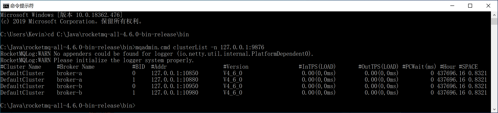

启动管理控制台：

```powershell
java -jar rocketmq-console-ng-1.0.1.jar --server.port=80  --rocketmq.config.namesrvAddr=127.0.0.1:9876;127.0.0.1:9877
```

通过 [控制台](http://localhost/#/cluster) 可以看到集群信息。

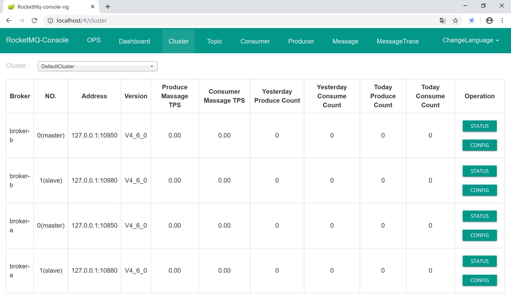

### 9.4.3 与 Spring Boot 集成

为了方便在 Spring Boot 中集成 RocketMQ，官方提供了 Spring Boot 的 starter。

#### 9.4.3.1 单机环境

新建 Spring Boot 项目，添加 Spring Web 启动器依赖。

> Spring  Boot 官方没有提供 RocketMQ 的 starter，由 RocketMQ 官方提供 starter，从`rocketmq-spring-boot-starter`命名上可以看出来，和 MyBatis 的命令类似。

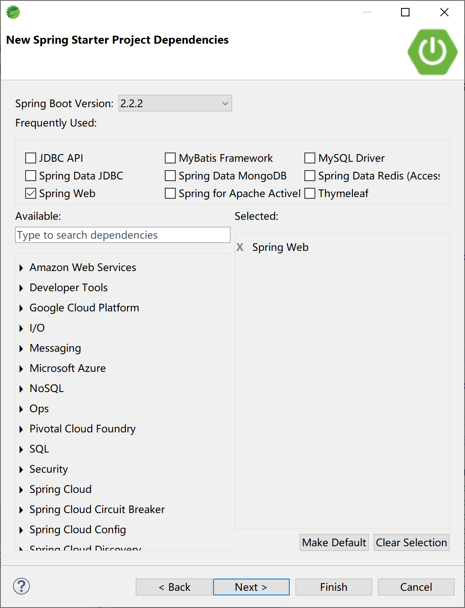

然后，在 pom 文件中手工添加 RocketMQ 的启动器依赖。

```xml
<dependency>
    <groupId>org.apache.rocketmq</groupId>
    <artifactId>rocketmq-spring-boot-starter</artifactId>
    <version>2.0.4</version>
</dependency>
```

在 application.yml 文件中，添加到 RocketMQ 的连接信息。

```yml
rocketmq:
  name-server: 127.0.0.1:9876
  producer:
    send-message-timeout: 300000
    group: my-group
```

创建消息提供者 RocketProducer，注入 RocketMQTemplate 类。

```java
package com.example.rocketmq.producer;

import org.apache.rocketmq.spring.core.RocketMQTemplate;
import org.springframework.beans.factory.annotation.Autowired;
import org.springframework.stereotype.Component;

@Component
public class RocketProducer {
	
	@Autowired
	private RocketMQTemplate rocketMQTemplate;
	
	public void sendMessage(String msg) {
		rocketMQTemplate.convertAndSend("test-topic",msg);
	}

}
```

创建消息消费者 RocketConsumer，实现 RocketMQListener 接口。

使用 @RocketMQMessageListener 注解，连接到 RocketMQ 的 test-topic 主题，监听消息。

```java
package com.example.rocketmq.consumer;

import org.apache.rocketmq.spring.annotation.RocketMQMessageListener;
import org.apache.rocketmq.spring.core.RocketMQListener;
import org.springframework.stereotype.Component;

@Component
@RocketMQMessageListener(consumerGroup = "my-consumer_test-topic", topic = "test-topic")
public class RocketConsumer implements RocketMQListener<String> {

	@Override
	public void onMessage(String message) {
		System.out.println("RocketMQ Consumer consume message: " + message);
	}

}
```

创建控制器 RocketController 类，和用户交互，向 RocketMQ 发送消息。

```java
package com.example.rocketmq.controller;

import org.springframework.beans.factory.annotation.Autowired;
import org.springframework.web.bind.annotation.RequestMapping;
import org.springframework.web.bind.annotation.RestController;

import com.example.rocketmq.producer.RocketProducer;

@RestController
@RequestMapping("/rocketmq/")
public class RocketController {

	@Autowired
	RocketProducer rocketProducer;
	
	@RequestMapping("/send")
	public String sendMsg(String msg) {
		rocketProducer.sendMessage(msg);
		return msg + " Sended to test-topic.";
	}
}
```

按照 9.4.1 小节中的单机 RocketMQ 服务器启动，然后启动 Spring Boot 应用。

```powershell
C:\Java\rocketmq-all-4.6.0-bin-release\bin>mqnamesrv.cmd
C:\Java\rocketmq-all-4.6.0-bin-release\bin>mqbroker.cmd -n 127.0.0.1:9876 autoCreateTopicEnable=true
```

打开浏览器，输入 [http://localhost:8080/rocketmq/send?msg=Kevin is a GOODMAN.](http://localhost:8080/rocketmq/send?msg=Kevin is a GOODMAN.)，向 RocketMQ 发送消息。


观察 Spring Boot 的控制台，检查消息消费者通过 System.out 打印出来的消息。

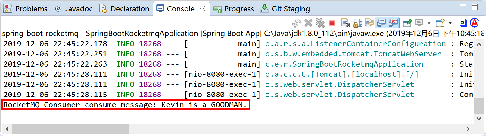

可以通过 RocketMQ [管理控制台](http://localhost/#/producer) 查看消息的生产者信息：

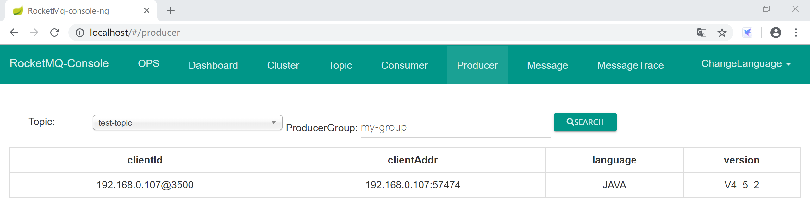

通过 RocketMQ [管理控制台](http://localhost/#/consumer) 查看消息的消费者信息：

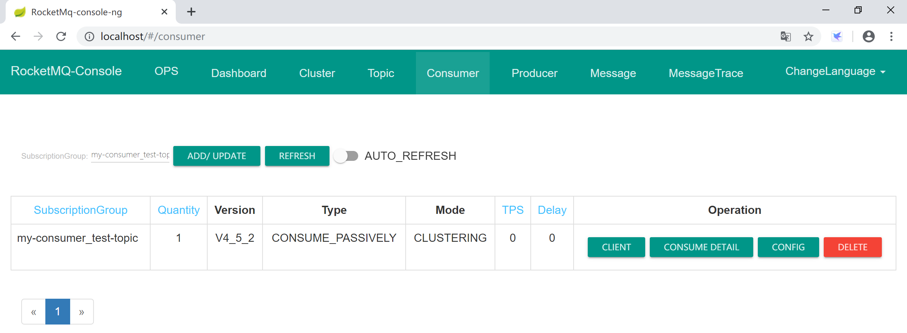

#### 9.4.3.2 集群环境

修改上面“9.4.3.1 单机环境”小节创建的 Spring Boot 项目的配置文件 application.yml，将 name-server 连接信息修改为集群的两个 Name Server 配置即可，其他所有代码都不需要修改。

```yml
rocketmq:
  name-server: 127.0.0.1:9876;127.0.0.1:9877
  producer:
    send-message-timeout: 300000
    group: my-group
```

测试运行，检查程序和集群是否正常匹配工作。

通过浏览器发送消息：


在 Spring Boot 的控制台中，检查消息消费者打印出来的信息：

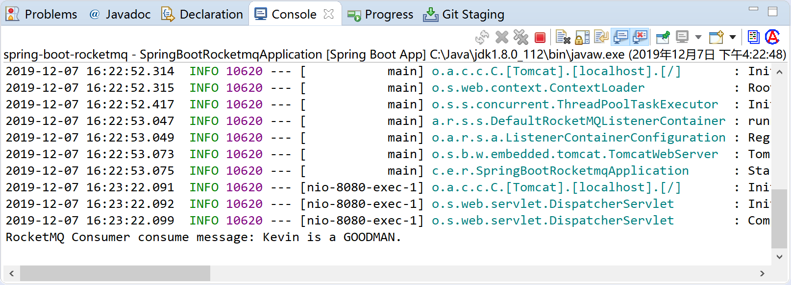

在 RocketMQ 管理控制台中，可以看到这条消息是由 broker-b 接收和处理的。

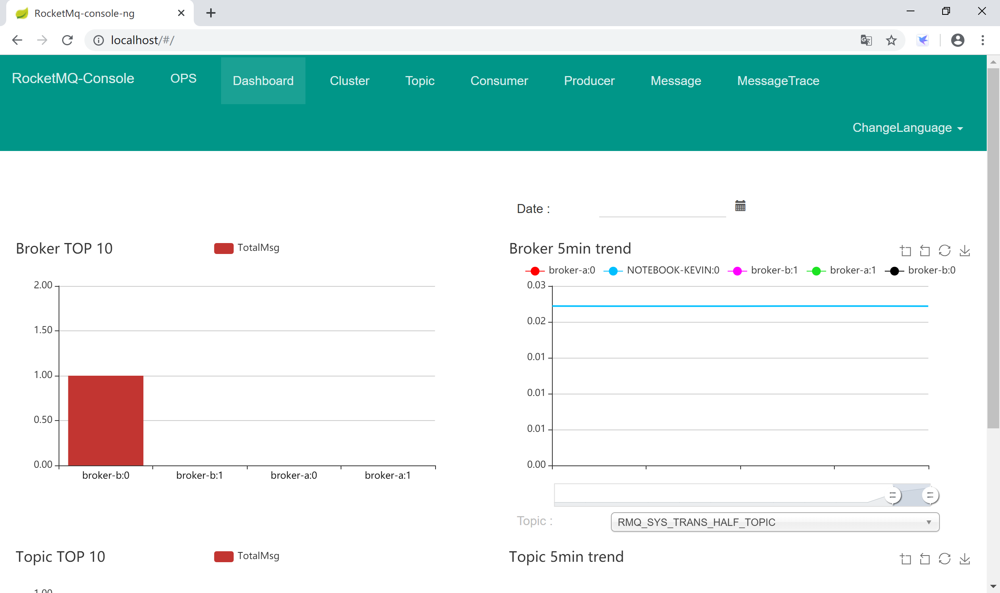

> 本小节示例项目代码：
>
> [https://github.com/gyzhang/SpringBootCourseCode/tree/master/spring-boot-rocketmq](https://github.com/gyzhang/SpringBootCourseCode/tree/master/spring-boot-rocketmq)
