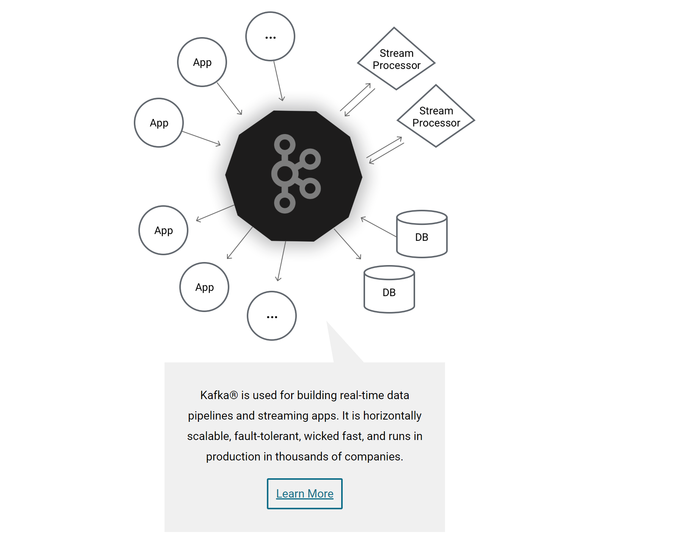
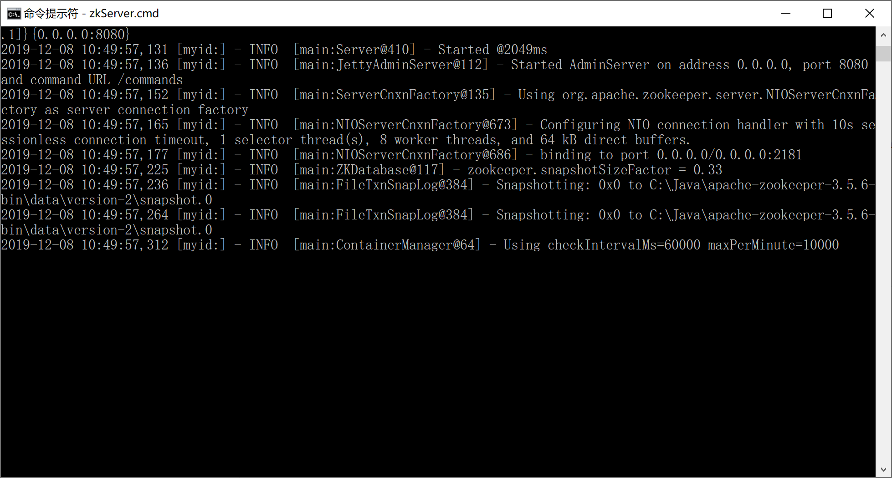
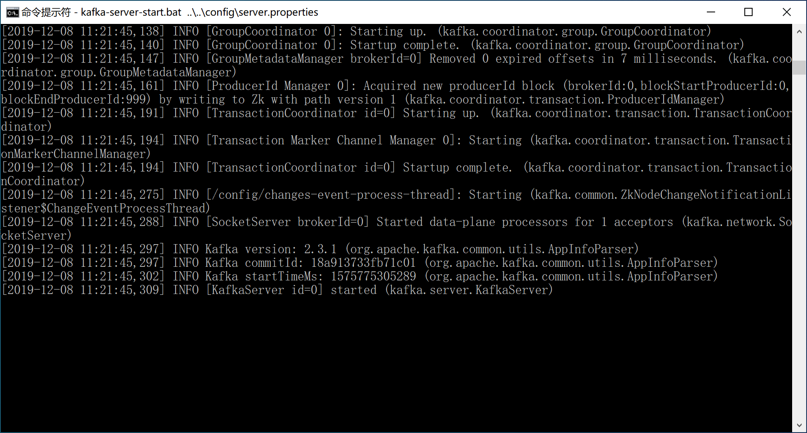
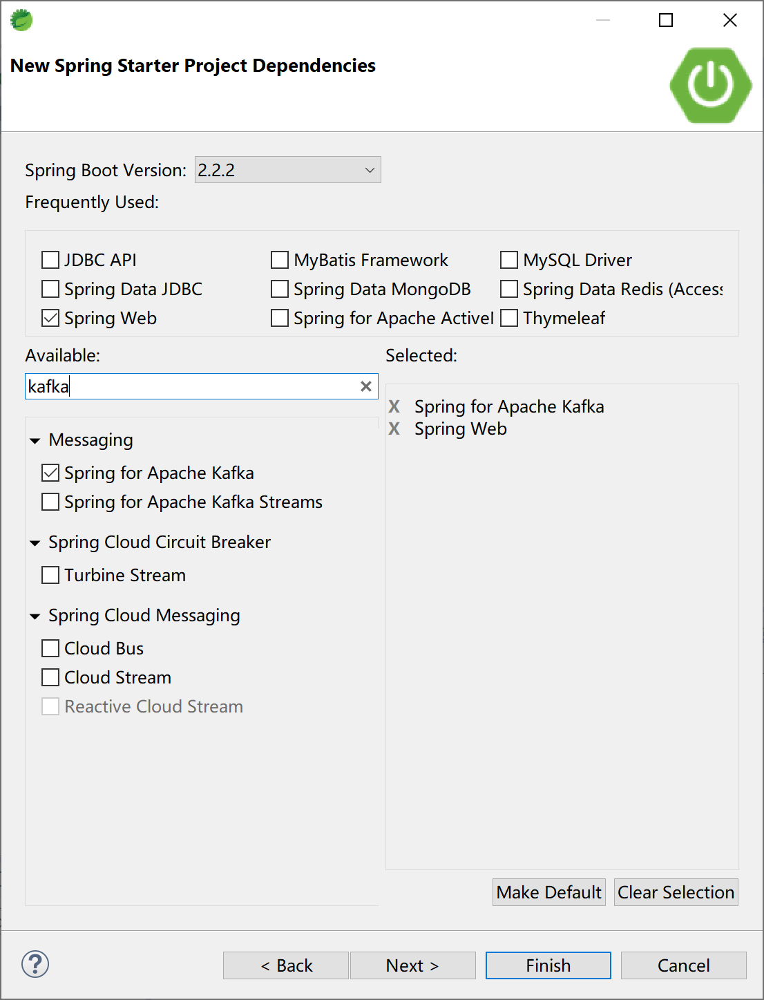
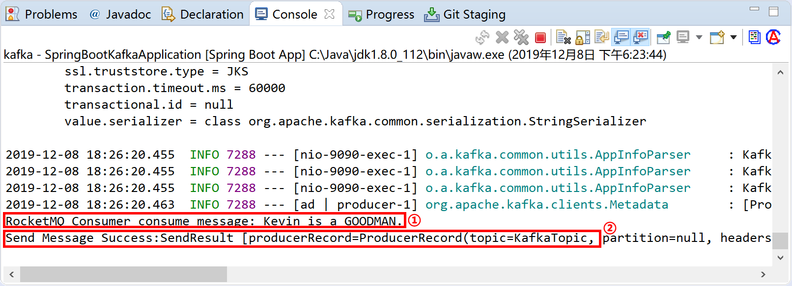

## 9.5 Spring Boot集成Kafka


Kafka最初由Linkedin公司开发，是一个分布式、分区的、多副本的、多订阅者，基于zookeeper协调的分布式日志系统（也可以当做MQ系统）。常见可以用于web/nginx日志、访问日志，消息服务等等，Linkedin于2010年贡献给了Apache基金会并成为顶级开源项目。

> Kafka®用于构建实时数据管道和流应用程序。它具有横向可扩展性、容错性、极快的速度，并在数千家公司的生产中运行。




主要应用场景是：日志收集系统和消息系统。

Kafka的主要设计目标：

- 以时间复杂度为O(1)的方式提供消息持久化能力，即使对TB级以上数据也能保证常数时间的访问性能。
- 高吞吐率。即使在非常廉价的商用机器上也能做到单机支持每秒10万+条消息的传输。
- 支持Kafka Server间的消息分区，及分布式消费，同时保证每个分区内的消息顺序传输。
- 同时支持离线数据处理和实时数据处理。
- 支持在线水平扩展。

### 9.5.1 概念

为了理解Kafka，需要了解Kafka中的术语。下图展示了Kafka的相关概念以及之间的关系：


上图中一个topic配置了3个partition。Partition1有两个offset：0和1。Partition2有4个offset。Partition3有1个offset。

如果一个topic的副本数为3，那么Kafka将在集群中为每个partition创建3个相同的副本。集群中的每个broker存储一个或多个partition。多个producer和consumer可同时生产和消费数据。

#### 9.5.1.1 broker

Kafka 集群包含一个或多个服务器，服务器节点称为broker。broker存储topic的数据。如果某topic有N个partition，集群有N个broker，那么每个broker存储该topic的一个partition。

如果某topic有N个partition，集群有(N+M)个broker，那么其中有N个broker存储该topic的一个partition，剩下的M个broker不存储该topic的partition数据。

如果某topic有N个partition，集群中broker数目少于N个，那么一个broker存储该topic的一个或多个partition。在实际生产环境中，尽量避免这种情况的发生，这种情况容易导致Kafka集群数据不均衡。

#### 9.5.1.2 Topic

每条发布到Kafka集群的消息都有一个类别，这个类别被称为Topic。（物理上不同Topic的消息分开存储，逻辑上一个Topic的消息虽然保存于一个或多个broker上但用户只需指定消息的Topic即可生产或消费数据而不必关心数据存于何处）。

Topic类似于数据库的表名。

#### 9.5.1.3 Partition

topic中的数据分割为一个或多个partition。每个topic至少有一个partition。每个partition中的数据使用多个segment文件存储。partition中的数据是有序的，不同partition间的数据丢失了数据的顺序。如果topic有多个partition，消费数据时就不能保证数据的顺序。在需要严格保证消息的消费顺序的场景下，需要将partition数目设为1。

#### 9.5.1.4 Producer

生产者即数据的发布者，该角色将消息发布到Kafka的topic中。broker接收到生产者发送的消息后，broker将该消息追加到当前用于追加数据的segment文件中。生产者发送的消息，存储到一个partition中，生产者也可以指定数据存储的partition。

#### 9.5.1.5 Consumer

消费者就是数据的使用者，可以从broker中读取数据。消费者可以消费多个topic中的数据。

#### 9.5.1.6 Consumer Group

每个Consumer属于一个特定的Consumer Group（可为每个Consumer指定group name，若不指定group name则属于默认的group）。

#### 9.5.1.7 Leader

每个partition有多个副本，其中有且仅有一个作为Leader，Leader是当前负责数据的读写的partition。

#### 9.5.1.8 Follower

Follower跟随Leader，所有写请求都通过Leader路由，数据变更会广播给所有Follower，Follower与Leader保持数据同步。如果Leader失效，则从Follower中选举出一个新的Leader。当Follower与Leader挂掉、卡住或者同步太慢，leader会把这个follower从“in sync replicas”（ISR）列表中删除，重新创建一个Follower。

### 9.5.2 安装配置

到[官网下载](http://kafka.apache.org/downloads)最新版本的使用Scala 2.12的Kafka 2.3.1，Kafka需要依赖 [ZooKeeper](https://zookeeper.apache.org/)，需要到zookeeper[官网下载](https://www-eu.apache.org/dist/zookeeper/zookeeper-3.5.6/)最新版本的ZooKeeper 3.5.6并提前安装配置好。

> Kafka uses [ZooKeeper](https://zookeeper.apache.org/) so you need to first start a ZooKeeper server if you don't already have one. You can use the convenience script packaged with kafka to get a quick-and-dirty single-node ZooKeeper instance.
>
> `bin/zookeeper-server-start.sh config/zookeeper.properties`

#### 9.5.2.1 安装ZooKeeper

解压下载后的apache-zookeeper-3.5.6-bin.tar.gz到磁盘，例如`C:\Java\apache-zookeeper-3.5.6-bin`目录。

> Windows下使用WinRAR解压apache-zookeeper-3.5.6-bin.tar.gz有可能会出现错误，可使用7zip解压即可。

在ZooKeeper安装目录下创建data目录，例如`C:\Java\apache-zookeeper-3.5.6-bin\data`。

进入`C:\Java\apache-zookeeper-3.5.6-bin\conf`目录，拷贝zoo_sample.cfg为zoo.cfg，然后编辑配置信息。

```properties
# The number of milliseconds of each tick
tickTime=2000
# The number of ticks that the initial 
# synchronization phase can take
initLimit=10
# The number of ticks that can pass between 
# sending a request and getting an acknowledgement
syncLimit=5
# the directory where the snapshot is stored.
# do not use /tmp for storage, /tmp here is just 
# example sakes.
dataDir=C:/Java/apache-zookeeper-3.5.6-bin/data
# the port at which the clients will connect
clientPort=2181
# the maximum number of client connections.
# increase this if you need to handle more clients
#maxClientCnxns=60
#
# Be sure to read the maintenance section of the 
# administrator guide before turning on autopurge.
#
# http://zookeeper.apache.org/doc/current/zookeeperAdmin.html#sc_maintenance
#
# The number of snapshots to retain in dataDir
#autopurge.snapRetainCount=3
# Purge task interval in hours
# Set to "0" to disable auto purge feature
#autopurge.purgeInterval=1
```

打开命令提示符窗口，进入ZooKeeper的bin目录，执行`zkServer.cmd`命令启动服务。



在学习环境下，我们就不演示配置ZooKeeper高可用集群了。

#### 9.5.2.2 安装Kafka

解压下载后的kafka_2.12-2.3.1.tgz文件到磁盘，例如`C:\Java\kafka_2.12-2.3.1`目录。

在Kafka安装目录下创建logs目录（`C:\Java\kafka_2.12-2.3.1\logs`），用来存放日志文件。

编辑Kafka安装目录下config目录下的server.properties文件（`C:\Java\kafka_2.12-2.3.1\config\server.properties`）。修改的地方为`log.dirs=C:/Java/kafka_2.12-2.3.1/logs`（第60行）。需要检查连接到ZooKeeper的配置信息`zookeeper.connect=localhost:2181`（第123行）是否正确。

```properties
# Licensed to the Apache Software Foundation (ASF) under one or more
# contributor license agreements.  See the NOTICE file distributed with
# this work for additional information regarding copyright ownership.
# The ASF licenses this file to You under the Apache License, Version 2.0
# (the "License"); you may not use this file except in compliance with
# the License.  You may obtain a copy of the License at
#
#    http://www.apache.org/licenses/LICENSE-2.0
#
# Unless required by applicable law or agreed to in writing, software
# distributed under the License is distributed on an "AS IS" BASIS,
# WITHOUT WARRANTIES OR CONDITIONS OF ANY KIND, either express or implied.
# See the License for the specific language governing permissions and
# limitations under the License.

# see kafka.server.KafkaConfig for additional details and defaults

############################# Server Basics #############################

# The id of the broker. This must be set to a unique integer for each broker.
broker.id=0

############################# Socket Server Settings #############################

# The address the socket server listens on. It will get the value returned from 
# java.net.InetAddress.getCanonicalHostName() if not configured.
#   FORMAT:
#     listeners = listener_name://host_name:port
#   EXAMPLE:
#     listeners = PLAINTEXT://your.host.name:9092
#listeners=PLAINTEXT://:9092

# Hostname and port the broker will advertise to producers and consumers. If not set, 
# it uses the value for "listeners" if configured.  Otherwise, it will use the value
# returned from java.net.InetAddress.getCanonicalHostName().
#advertised.listeners=PLAINTEXT://your.host.name:9092

# Maps listener names to security protocols, the default is for them to be the same. See the config documentation for more details
#listener.security.protocol.map=PLAINTEXT:PLAINTEXT,SSL:SSL,SASL_PLAINTEXT:SASL_PLAINTEXT,SASL_SSL:SASL_SSL

# The number of threads that the server uses for receiving requests from the network and sending responses to the network
num.network.threads=3

# The number of threads that the server uses for processing requests, which may include disk I/O
num.io.threads=8

# The send buffer (SO_SNDBUF) used by the socket server
socket.send.buffer.bytes=102400

# The receive buffer (SO_RCVBUF) used by the socket server
socket.receive.buffer.bytes=102400

# The maximum size of a request that the socket server will accept (protection against OOM)
socket.request.max.bytes=104857600


############################# Log Basics #############################

# A comma separated list of directories under which to store log files
log.dirs=C:/Java/kafka_2.12-2.3.1/logs

# The default number of log partitions per topic. More partitions allow greater
# parallelism for consumption, but this will also result in more files across
# the brokers.
num.partitions=1

# The number of threads per data directory to be used for log recovery at startup and flushing at shutdown.
# This value is recommended to be increased for installations with data dirs located in RAID array.
num.recovery.threads.per.data.dir=1

############################# Internal Topic Settings  #############################
# The replication factor for the group metadata internal topics "__consumer_offsets" and "__transaction_state"
# For anything other than development testing, a value greater than 1 is recommended for to ensure availability such as 3.
offsets.topic.replication.factor=1
transaction.state.log.replication.factor=1
transaction.state.log.min.isr=1

############################# Log Flush Policy #############################

# Messages are immediately written to the filesystem but by default we only fsync() to sync
# the OS cache lazily. The following configurations control the flush of data to disk.
# There are a few important trade-offs here:
#    1. Durability: Unflushed data may be lost if you are not using replication.
#    2. Latency: Very large flush intervals may lead to latency spikes when the flush does occur as there will be a lot of data to flush.
#    3. Throughput: The flush is generally the most expensive operation, and a small flush interval may lead to excessive seeks.
# The settings below allow one to configure the flush policy to flush data after a period of time or
# every N messages (or both). This can be done globally and overridden on a per-topic basis.

# The number of messages to accept before forcing a flush of data to disk
#log.flush.interval.messages=10000

# The maximum amount of time a message can sit in a log before we force a flush
#log.flush.interval.ms=1000

############################# Log Retention Policy #############################

# The following configurations control the disposal of log segments. The policy can
# be set to delete segments after a period of time, or after a given size has accumulated.
# A segment will be deleted whenever *either* of these criteria are met. Deletion always happens
# from the end of the log.

# The minimum age of a log file to be eligible for deletion due to age
log.retention.hours=168

# A size-based retention policy for logs. Segments are pruned from the log unless the remaining
# segments drop below log.retention.bytes. Functions independently of log.retention.hours.
#log.retention.bytes=1073741824

# The maximum size of a log segment file. When this size is reached a new log segment will be created.
log.segment.bytes=1073741824

# The interval at which log segments are checked to see if they can be deleted according
# to the retention policies
log.retention.check.interval.ms=300000

############################# Zookeeper #############################

# Zookeeper connection string (see zookeeper docs for details).
# This is a comma separated host:port pairs, each corresponding to a zk
# server. e.g. "127.0.0.1:3000,127.0.0.1:3001,127.0.0.1:3002".
# You can also append an optional chroot string to the urls to specify the
# root directory for all kafka znodes.
zookeeper.connect=localhost:2181

# Timeout in ms for connecting to zookeeper
zookeeper.connection.timeout.ms=6000


############################# Group Coordinator Settings #############################

# The following configuration specifies the time, in milliseconds, that the GroupCoordinator will delay the initial consumer rebalance.
# The rebalance will be further delayed by the value of group.initial.rebalance.delay.ms as new members join the group, up to a maximum of max.poll.interval.ms.
# The default value for this is 3 seconds.
# We override this to 0 here as it makes for a better out-of-the-box experience for development and testing.
# However, in production environments the default value of 3 seconds is more suitable as this will help to avoid unnecessary, and potentially expensive, rebalances during application startup.
group.initial.rebalance.delay.ms=0
```

打开命令提示符窗口，进入`C:\Java\kafka_2.12-2.3.1\bin\windows`目录，执行`kafka-server-start.bat ..\..\config\server.properties`命令，启动Kafka服务器，默认服务监听端口9092。

> [2019-12-08 11:21:44,907] INFO Awaiting socket connections on 0.0.0.0:9092. (kafka.network.Acceptor)



### 9.5.3 与Spring Boot集成

Spring为Kafka提供了依赖配置，集成非常方便。并且提供KafkaTemplate模板类来简化编码过程。

创建新的Spring  Boot项目，添加`Spring Web`和`Spring for Apache Kafka`依赖。



pom文件中关键的Kafka依赖：

```xml
<dependency>
    <groupId>org.springframework.kafka</groupId>
    <artifactId>spring-kafka</artifactId>
</dependency>
```

在application.yml配置文件中配置连接到Kafka的信息：

```yaml
server:
  port: 9090
  
spring:
  kafka:
    bootstrap-servers:
    - 127.0.0.1:9092
    consumer:
      group-id: test-consumer-group
      key-deserializer: org.apache.kafka.common.serialization.StringDeserializer
      value-deserializer: org.apache.kafka.common.serialization.StringDeserializer
    producer:
      key-serializer: org.apache.kafka.common.serialization.StringSerializer
      value-serializer: org.apache.kafka.common.serialization.StringSerializer
```

创建消息生产者KafkaProducer类，添加回调方法（消息消费成功后消息中间件会回调消息生产者）：

```java
package com.example.kafka.producer;

import org.springframework.beans.factory.annotation.Autowired;
import org.springframework.kafka.core.KafkaTemplate;
import org.springframework.kafka.support.SendResult;
import org.springframework.stereotype.Component;
import org.springframework.util.concurrent.ListenableFuture;
import org.springframework.util.concurrent.ListenableFutureCallback;

@Component
public class KafkaProducer {

	@Autowired
	private KafkaTemplate<String, String> kafkaTemplate;

	public void sendMessage(String msg) {
		ListenableFuture<SendResult<String, String>> future = kafkaTemplate.send("KafkaTopic", msg);
		future.addCallback(new ListenableFutureCallback<SendResult<String, String>>() {
			@Override
			public void onFailure(Throwable throwable) {
				System.out.println("Send Message Failure:" + throwable.getMessage());
			}

			@Override
			public void onSuccess(SendResult<String, String> sendResult) {
				System.out.println("Send Message Success:" + sendResult.toString());
			}
		});
	}

}
```

创建消息消费者KafkaConsumer类：

```java
package com.example.kafka.consumer;

import org.apache.kafka.clients.consumer.ConsumerRecord;
import org.springframework.kafka.annotation.KafkaListener;
import org.springframework.stereotype.Component;

@Component
public class KafkaConsumer {
	
    @KafkaListener(topics = {"KafkaTopic"})
    public void listen(ConsumerRecord<?, ?> record) {
    	System.out.println("RocketMQ Consumer consume message: " + record.value());
    }

}
```

创建控制器KafkaController类与用户交互：

```java
package com.example.kafka.controller;

import org.springframework.beans.factory.annotation.Autowired;
import org.springframework.web.bind.annotation.RequestMapping;
import org.springframework.web.bind.annotation.RestController;

import com.example.kafka.producer.KafkaProducer;

@RestController
@RequestMapping("/kafka/")
public class KafkaController {
	
	@Autowired
	KafkaProducer kafkaProducer;
	
	@RequestMapping("/send")
	public String sendMsg(String msg) {
		kafkaProducer.sendMessage(msg);
		return msg + " Sended to KafkaTopic.";
	}

}
```

这个时候启动Spring Boot应用可能会报错，原因是没有创建“KafkaTopic”主题，需要提前在Kafka中创建这个“KafkaTopic”主题。

```
org.springframework.context.ApplicationContextException: Failed to start bean 'org.springframework.kafka.config.internalKafkaListenerEndpointRegistry'; nested exception is java.lang.IllegalStateException: Topic(s) [KafkaTopic] is/are not present and missingTopicsFatal is true
```

> 创建KafkaTopic主题：`kafka-topics.bat -create --bootstrap-server localhost:9092 -replication-factor 1 --partitions 1 --topic KafkaTopic`
>
> 查看主题：`kafka-topics -list --bootstrap-server localhost:9092`

在确保Kafka消息中间件中有“KafkaTopic”主题的前提下启动Spring Boot应用。

打开浏览器，访问[http://localhost:9090/kafka/send?msg=Kevin is a GOODMAN.](http://localhost:9090/kafka/send?msg=Kevin is a GOODMAN.)地址，向Kafka发送消息。


观察Spring Boot应用的控制台，消息消费者KafkaConsumer消费消息后在控制台上输出正确的消息`RocketMQ Consumer consume message: Kevin is a GOODMAN.`，还可以看到回调消息生产者输出的结果`Send Message Success...`。

