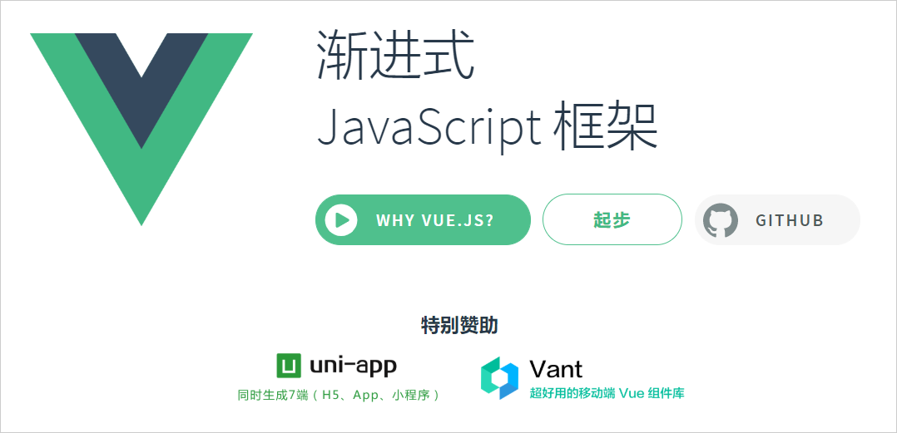

## A1.1 Vue介绍

### A1.1.1 vue 简史

Vue.js 的创始人是国人尤雨溪，他的开发初衷是想做一个自己喜欢的框架。作者受 Angular 的启发，vue 于 2013 年年底成型，于 2014 年 01 月 24 日正式对外发布，版本号 0.8.0。2015 年 06 月 13 日 vue 第一个里程碑 V1.0.0 正式发布，同年 vue 相关产品 vue-router、vuex、vue-cli 相继发布，随后 vue 社区也在持续更新中，现在 vue 版本已经到 4.0.0 。

### A1.1.2 vue 是什么？

vue 是一款友好，多用途且高性能的渐进式 JavaScript 框架，换言之，如果已有一个现成的服务端应用，你可以将 vue 作为一部分嵌入其中，带来更丰富的交互体验。如果需要前端实现更多的业务逻辑，vue 的核心库和生态系统即可满足。vue 和其他前端框架一样，可定义复用组件，每个文件包含 html、JavaScript、css 三部分可以渲染网页中相应的位置。

vue 官网：[https://cn.vuejs.org/](https://cn.vuejs.org/)

