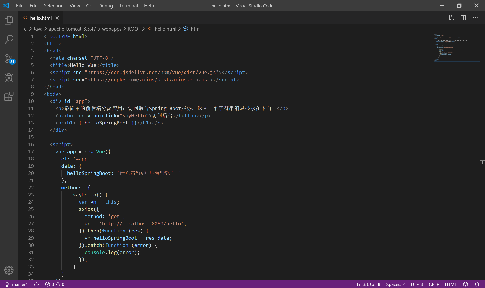

## A.2 Vue开发环境配置

1. 运行环境 node.js，官网下载 LTS 最新版本安装。

2. 开发工具推荐 Visual Studio Code（VSCode），官网下载最新版本即可。也可以使用其它任何 html 编辑器。

3. vue 安装

   此处采用 CDN 方式安装：

- 直接 &lt;script&gt;  引入：官网下载 vue.js 文件，在页面中直接引入``

- CDN：官网提供开发环境、生产环境和原生 ES modules 的引入地址``

- NPM：使用 node.js 的包管理工具 npm 下载最新稳定版的 vue `npm install vue`

- 命令行工具（CLI）：vue 提供一个官方的 CLI ，是单页面应用快速搭建繁杂的脚手架。作为后期快速搭建单页面应用的工具。

