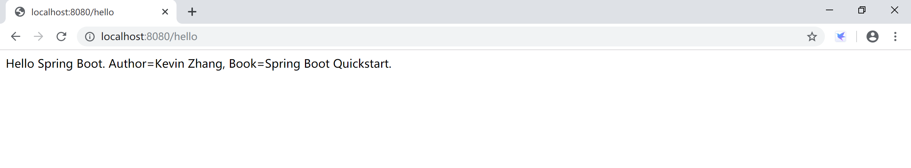
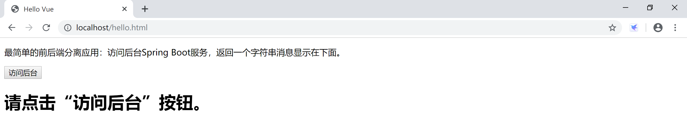
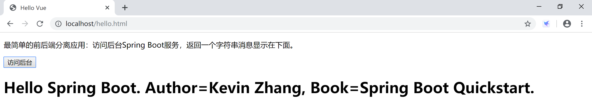

## 附录1.3 Hello Vue

本小节使用 vue + Spring Boot 演示一个前后端分离的场景下读取和展示信息的项目，是使用vue前后端分离的“Hello World.”。

本示例使用的后台代码如下，其中需要关注的是`@CrossOrigin(origins = "*")`这个注解，它注解了这个方法（sayHello）是支持跨域访问的。

```java
package com.example.hello.controller;

import org.springframework.beans.factory.annotation.Value;
import org.springframework.web.bind.annotation.CrossOrigin;
import org.springframework.web.bind.annotation.RequestMapping;
import org.springframework.web.bind.annotation.RestController;

@RestController
public class SayHelloController {
	@Value("${net.xprogrammer.author}")
	private String author;
	
	@Value("${net.xprogrammer.book}")
	private String book;
	
	@RequestMapping("/hello")
	@CrossOrigin(origins = "*")
	public String sayHello() {
		return "Hello Spring Boot. Author=" + author + ", Book=" + book;
	}

}
```

上面给出的后台代码访问返回的数据情况如下：



首先，在tomcat的ROOT应用下直接建立一个hello.html，方便我们测试。

> 例如，这个路径：C:\Java\apache-tomcat-8.5.47\webapps\ROOT\hello.html，非常简单粗暴。


```html
<!DOCTYPE html>
<html>
<head>
  <meta charset="UTF-8">
  <title>Hello Vue</title>
  <script src="https://cdn.jsdelivr.net/npm/vue/dist/vue.js"></script>
  <script src="https://unpkg.com/axios/dist/axios.min.js"></script>
</head>
<body>
  <div id="app">
    <p>最简单的前后端分离应用：访问后台Spring Boot服务，返回一个字符串消息显示在下面。</p>
    <p><button v-on:click="sayHello">访问后台</button></p>
    <p><h1>{{ helloSpringBoot }}</h1></p>
  </div>

  <script>
    var app = new Vue({
      el: '#app',
      data: {
        helloSpringBoot: '请点击“访问后台”按钮。'
      },
      methods: {
          sayHello() {
            var vm = this;
            axios({
              method: 'get',
              url: 'http://localhost:8080/hello',
            }).then(function (res) {
              vm.helloSpringBoot = res.data;
            }).catch(function (error) {
              console.log(error);
            });
          }          
      }
    })
  </script>
</body>
</html>
```

- 在创建的 hello.html 文件内，引入 vue.js，此处采用 CDN 方式直接引入 vue.js 。当引入 vue.js 后，会声明一个 Vue 全局变量，通过 `new Vue()` 的方式可以获得一个 vue 应用。
- vue.js 没有集成 ajax 功能，要使用 ajax 功能，可以使用 vue 官方推荐的 axios.js 库来做 ajax 的交互，这个示例中我们也通过CDN引入axios。 
- 在页面声明一个 `id="app"` 的 div 标签，在 div 内部使用 vue 常见的文本插值方式插入一个 helloSpringBoot 变量。
- 使用 ID 选择器将 `#app` 赋给 Vue 的选项的 el 属性，即绑定 vue 视图。
- 在vue内部的data部分，定义helloSpringBoot并为其赋一个初始值“请点击“访问后台”按钮。”。
- 添加一个按钮，绑定到sayHello方法。
- 在sayHello方法内访问后台服务（http://localhost:8080/hello），将返回的数据赋给helloSpringBoot 变量（`vm.helloSpringBoot = res.data;`）。
- vue自行处理更新页面上的数据。

访问Tomcat的hello.html页面，显示的是页面及vue初始化后的效果，其中helloSpringBoot显示的是初始值。



点击“访问后台”按钮后，页面通过axios发起ajax请求后台服务，获取数据，并显示，效果如下：



**补充内容：跨域**

跨域问题的产生是出于浏览器的同源策略限制。

同源策略（Sameoriginpolicy）是一种约定，它是浏览器最核心也最基本的安全功能，如果缺少了同源策略，则浏览器的正常功能可能都会受到影响。可以说Web是构建在同源策略基础之上的，浏览器只是针对同源策略的一种实现。同源策略会阻止一个域的javascript脚本和另外一个域的内容进行交互。所谓同源（即指在同一个域）就是两个页面具有相同的协议（protocol），主机（host）和端口号（port）。

| 当前页面url               | 被请求页面url                   | 是否跨域 | 原因                           |
| :------------------------ | :------------------------------ | :------: | :----------------------------- |
| http://www.test.com/      | http://www.test.com/index.html  |    否    | 同源（协议、域名、端口号相同） |
| http://www.test.com/      | https://www.test.com/index.html |    是    | 协议不同（http/https）         |
| http://www.test.com/      | http://www.baidu.com/           |    是    | 主域名不同（test/baidu）       |
| http://www.test.com/      | http://blog.test.com/           |    是    | 子域名不同（www/blog）         |
| http://www.test.com:8080/ | http://www.test.com:7001/       |    是    | 端口号不同（8080/7001）        |

跨域请求的时候，客户端会自动发起一个 OPTIONS 方法到服务器，客户端发起的这个 OPTIONS 可以说是一个“预请求”，用于探测后续真正需要发起的跨域请求对于服务器来说是否是安全可接受的。

请求头 Access-Control-Request-Method 用于提醒服务器在接下来的请求中将会使用什么样的方法来发起请求：

- Access-Control-Allow-Method 和 Access-Control-Allow-Origin 分别告知客户端，服务器允许客户端用于跨域的方法和域名。

- 当你的请求地址和浏览器上的url地址不一样的时候，由于同源策略，将请求不到资源，将无法“跨域”获取资源。ajax，vue中的axios都会出现跨域问题。

Spring后台支持CORS跨域的办法有如下3种：

1. 通过配置类，为整个应用提供CORS跨域支持。

```java
@Configuration
public class MyConfiguration {

    @Bean
    public WebMvcConfigurer corsConfigurer() {
        return new WebMvcConfigurerAdapter() {
            @Override
            public void addCorsMappings(CorsRegistry registry) {
                registry.addMapping("/**");
            }
        };
    }
}
```

2. 控制器或控制器方法提供CORS跨域支持。

```java
@CrossOrigin(maxAge = 3600)
@RestController
@RequestMapping("/account")
public class AccountController {

    @CrossOrigin(origins = "http://domain2.com")
    @GetMapping("/{id}")
    public Account retrieve(@PathVariable Long id) {
        // ...
    }

    @DeleteMapping("/{id}")
    public void remove(@PathVariable Long id) {
        // ...
    }
}
```

3. 基于过滤器的CORS跨域支持。

```java
@Configuration
public class MyConfiguration {

    @Bean
    public FilterRegistrationBean corsFilter() {
        UrlBasedCorsConfigurationSource source = new UrlBasedCorsConfigurationSource();
        CorsConfiguration config = new CorsConfiguration();
        config.setAllowCredentials(true);
        config.addAllowedOrigin("http://domain1.com");
        config.addAllowedHeader("*");
        config.addAllowedMethod("*");
        source.registerCorsConfiguration("/**", config);
        FilterRegistrationBean bean = new FilterRegistrationBean(new CorsFilter(source));
        bean.setOrder(0);
        return bean;
    }
}
```

