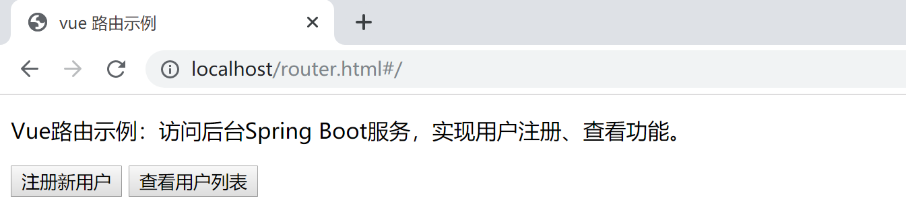
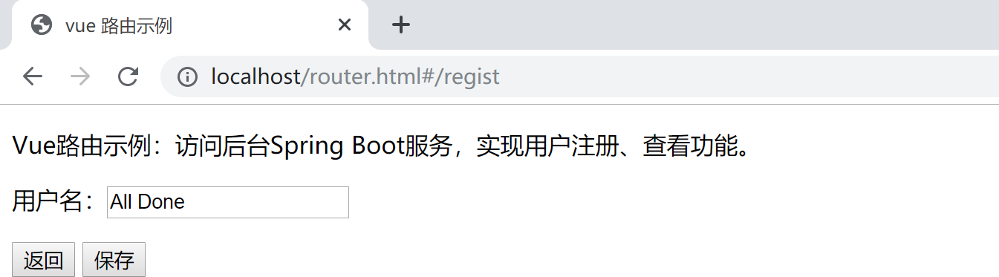
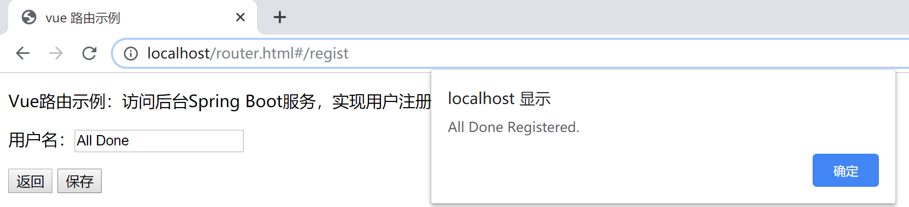
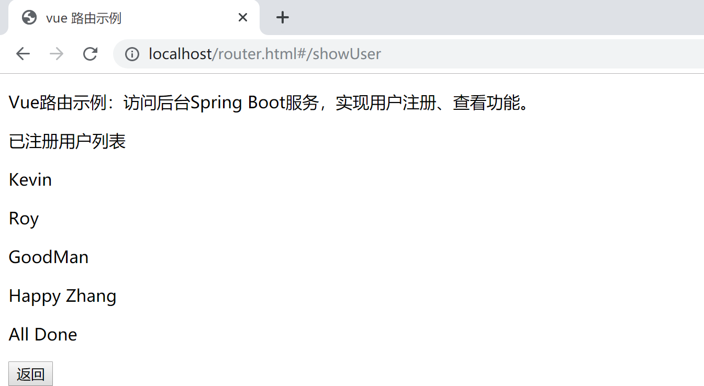

## A1.4 Vue路由示例

本小节使用 Vue + Vue-router + Spring Boot 演示一个前后端分离场景下实现用户注册、展示用户列表的路由切换项目，引入 vue-router 技术。

示例中使用的后端代码如下，其中需要关注的是`@CrossOrigin(origins = "*")`这个注解，它注解了这个方法（register、getUsers）是支持跨域访问的。

> 为了集中讲解vue的处理，简化处理后台数据处理逻辑，将注册的用户数据存入ServletContex的application的属性中。并且所有的业务逻辑都写在Controller中了。

```java
package com.example.vue.controller;

import java.util.ArrayList;
import java.util.List;

import javax.servlet.ServletContext;
import javax.servlet.http.HttpServletRequest;

import org.springframework.web.bind.annotation.CrossOrigin;
import org.springframework.web.bind.annotation.RequestMapping;
import org.springframework.web.bind.annotation.RestController;

@RestController
public class UserController {

	@RequestMapping("/register")
	@CrossOrigin(origins = "*")
	public String register(String name, HttpServletRequest request) {
		ServletContext application = request.getServletContext();
		@SuppressWarnings("unchecked")
		List<String> users = (List<String>) application.getAttribute("users");
		if (users == null || users.size() <= 0) {
			users = new ArrayList<>();
		}
		users.add(name);
		application.setAttribute("users", users);

		return name + " Registered.";
	}

	@RequestMapping("/getUsers")
	@CrossOrigin(origins = "*")
	public List<String> getUsers(HttpServletRequest request) {
		ServletContext application = request.getServletContext();
		@SuppressWarnings("unchecked")
		List<String> users = (List<String>) application.getAttribute("users");
		if (users == null || users.size() <= 0) {
			users = new ArrayList<>();
		}

		return users;
	}

}
```

上面的后台服务代码给出了两个接口：注册用户（@RequestMapping("/register")）、查询用户（@RequestMapping("/getUsers")）信息列表。其中查询用户信息列表返回的数据结构如下：

```json
[
    "Kevin",
    "Roy",
    "GoodMan",
    "Happy Zhang"
]
```

本示例前端代码如下：

为了简化示例过程，我们直接在 TOMCAT 下的 ROOT 文件夹下创建 router.html，以便于测试。

> 例如，这个路径：C:\Java\apache-tomcat-8.5.47\webapps\ROOT\router.html

```html
<!DOCTYPE html>
<html>

<head>
    <meta charset="UTF-8">
    <title>vue 路由示例</title>
    <script src="https://cdn.jsdelivr.net/npm/vue/dist/vue.js"></script>
    <script src="https://unpkg.com/axios/dist/axios.min.js"></script>
    <script src="https://unpkg.com/vue-router/dist/vue-router.js"></script>
</head>

<body>
    <div id="app">
        <p>Vue路由示例：访问后台Spring Boot服务，实现用户注册、查看功能。</p>
        <router-view></router-view>
    </div>

    <!-- 主页面组件 -->
    <template id="index">
      <div>
            <!-- 使用路由自带 router-link 组件来导航，通过传入 to 属性指定链接 -->
            <router-link to="/regist"><button>注册新用户</button></router-link>
            <router-link to="/showUser"><button>查看用户列表</button></router-link>
      </div>
    </template>

    <!-- 用户注册界面组件 -->
    <template id="regist">
      <div>
        <p>用户名：<input type="text" placeholder="请输入用户名" v-model="name"></p>
        <router-link to="/"><button>返回</button></router-link>
        <button v-on:click="save">保存</button>
      </div>
    </template>

    <!-- 用户信息列表组件 -->
    <template id="showUser">
        <div>
            <p>已注册用户列表</p>
            <p v-for="(i, index) in user_arr" v-on:key="index">{{i}}</p>
            <router-link to="/"><button>返回</button></router-link>
        </div>
    </template>


    <script type="text/javascript">
        // 定义主页面组件
        const index_component = {
            template: '#index', 
        };

        // 定义注册组件
        const regist_component = {
            template: '#regist',
            data() {
                return {
                    name: ''
                }
            },
            methods: {
                save() {
                    var vm = this;
                    axios({
                        method: 'get',
                        url: 'http://localhost:8080/register?name=' + vm.name
                    }).then(function(res) {
                        alert(res.data)
                    }).catch(function(error) {
                        console.log(error);
                    });
                }
            }
        };
        // 定义用户列表组件
        const user_component = {
            template: '#showUser',
            data() {
                return {
                    user_arr: []
                }
            },
            mounted() {
                var vm = this;
                axios({
                    method: 'get',
                    url: 'http://localhost:8080/getUsers'
                }).then(function(res) {
                    vm.user_arr = res.data;
                }).catch(function(error) {
                    console.log(error);
                });
            }
        };

        // 创建 router 实例，配置 routes
        const router = new VueRouter({
            routes: [{
                path: '/',
                component: index_component
            }, {
                path: '/regist',
                component: regist_component
            }, {
                path: '/showUser',
                component: user_component
            }]
        });

        // 创建 Vue 实例
        var vm = new Vue({
            el: '#app',
            router
        })
    </script>
</body>

</html>
```

实现 vue 路由的跳转功能分为4个步骤：

1.  引入 vue、axios、vue-router 的 js 文件。

- 在文件 router.html 内，采用 CDN 方式直接引入`vue.js` 。

- vue 官方推荐的`axios.js`库来做 ajax 的交互，本示例中我们也通过 CDN 方式引入 axios。 
- 引入 `vue-router.js` , 直接在 Vue 实例中通过 router 配置参数注入路由。

2. 定义组件。

- 创建一个组件的配置对象，该对象即为一个 vue 实例对象，包含属性同 vue 配置项相同，其属性为 vue 生命周期中的钩子函数。
- 组件配置对象中的 template 通过 id 选择器绑定注册界面组件。

3. 创建路由实例。

- 引入的 vue-router.js 文件声明了一个全局变量 VueRouter， 通过 `new VueRouter()` 创建路由实例。实例创建成功后，自带两个全局注册的组件：入口组件 `router-view`  导航组件 `router-link` 。
- 配置路由对象，其中需要注意的是 path、components 两个属性，path 在一个路由实例中必须全局唯一、components 必须指向一个具体的组件。

4. 创建 vue 实例

- 引入 vue.js 时，即存在一个全局的 Vue，通过 `new Vue()` 的方式可以获得一个 vue 应用，即 vue 实例。
- 使用 ID 选择器将 `#app` 赋给 Vue 的选项的 el 属性，即绑定 vue 视图。

实现本示例功能需要三个界面组件：

1. 主页面组件（`index`）：

   提供【注册新用户】和【查看用户列表】两个功能按钮，分别跳转到对应的界面。界面如下：

   

- 界面上两个按钮使用路由的导航组件  `router-link`  包裹，分别指向“regist”组件和“showUser”组件。

  ```html
  <router-link to="/regist"><button>注册新用户</button></router-link>
  <router-link to="/showUser"><button>查看用户列表</button></router-link>
  ```

2. 用户注册界面组件：

   点击主界面的【注册新用户】按钮进入该界面，界面如下：
   
   

- 【保存】按钮绑定 save 方法。

- save 方法内访问后台服务 （http://localhost:8080/register），携带参数 name 。该服务返回数据直接打印到浏览器 `alert(res.data)` 。

   

3. 用户信息列表界面组件：

   点击主界面的【查看用户列表】按钮进入该界面，界面如下：

   

- mounted() 是 vue 生命周期的一个钩子函数，是指数据挂在到标签上以后执行，即挂载完成。在该方法内访问后台服务（http://localhost:8080/hello）获取用户列表信息数据，将返回的数据赋给 user_arr 变量（`user_arr = res.data;`）。
- vue自行处理更新页面上的数据。