# A3 在Docker中部署Spring Boot应用

Docker是一个开源的引擎，可以轻松的为任何应用创建一个轻量级的、可移植的、自给自足的容器。开发者在笔记本上编译测试通过的容器可以批量地在生产环境中部署，包括VMs（虚拟机）、bare metal、OpenStack 集群和其他的基础应用平台。

Docker属于Linux容器的一种封装，提供简单易用的容器使用接口，它是目前最流行的Linux容器解决方案。Docker将应用程序与该程序的依赖打包在一个文件里面，运行这个文件，就会生成一个虚拟容器。程序在这个虚拟容器里运行，就好像在真实的物理机上运行一样，有了Docker，就再也不用担心环境问题了。

> 和Docker经常一起提到的是虚拟机，不严格的可以将Docker与虚拟机类比于线程与进程。在宿主机器中启动一个Docker容器的系统开销远远小于启动一个虚拟机。

Docker通常用于如下场景：

- web应用的自动化打包和发布；
- 自动化测试和持续集成、发布；
- 在服务型环境中部署和调整数据库或其他的后台应用；
- 从头编译或者扩展现有的OpenShift或Cloud Foundry平台来搭建自己的PaaS环境；
- 在分布式微服务架构场景下弹性扩容部署。

本附录中，我们将使用一个最简单的Spring Boot项目来讲解如何在macOS的Docker容器中部署应用。

> 为什么不选择Windows？因为Docker天生就是为Linux开发的，在macOS中使用也很方便。在很长一段时间内，都没有直接在Windows上直接运行的Docker环境，在Windows中需要通过Linux虚拟机间接的使用。当前官方为最新的Docker提供了在Windows 10的某些版本（专业版）上直接运行的环境。
>
> 所以本附录中的示例使用macOS，所有的操作和命令与Linux中的操作保持一致。

## A3.1 概念

Docker系统有两个程序：docker服务端和docker客户端。其中docker服务端是一个服务进程，管理着所有的容器。docker客户端则扮演着docker服务端的远程控制器，可以用来控制docker的服务端进程。大部分情况下，docker服务端和客户端运行在一台机器上。

- **Docker daemon：**Docker守护进程，运行在宿主机上（如本附录写作时，其运行在我的MacBook Pro上），用户通过Docker Client（在其中使用Docker 命令）与Docker daemon交互。

- **Docker client：**Docker命令行工具，是用户使用Docker的主要方式。Docker client与Docker daemon通信并将结果返回给用户，Docker client也可以通过socket或者RESTful API访问远程的Docker daemon。

- **Docker image：**镜像是只读的，镜像中包含有需要运行的文件。镜像用来创建 container，一个镜可以运行多个container（image和container可以简单的类比于类和对象的关系）；镜像可以通过Dockerfile创建，也可以从Docker hub/registry上下载。

- **Docker container：**容器是Docker的运行组件，可以被创建、启动、停止、删除、暂停等。启动一个镜像就是创建运行一个容器，容器是一个隔离环境，多个容器之间不会相互影响，保证容器中的程序运行在一个相对安全的环境中。

- **Docker hub/registry：**保存、共享和管理Docker镜像的仓库（类似于github，或者maven中央仓库），用户可以上传或者下载上面的镜像，官方地址[https://registry.hub.docker.com](https://registry.hub.docker.com)，也可以搭建自己私有的 Docker registry（类似于私服）。

## A3.2 安装

到Docker[官方下载](https://download.docker.com/mac/stable/Docker.dmg)Docker Desktop，如果下载速度太慢，建议使用下载工具下载，如迅雷。

> Windows 版下载地址是：[https://download.docker.com/win/stable/Docker Desktop Installer.exe](https://download.docker.com/win/stable/Docker%20Desktop%20Installer.exe)

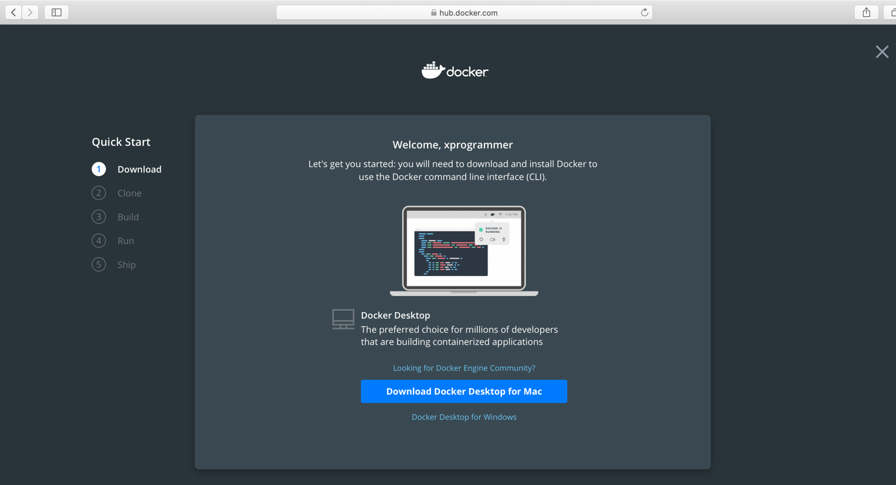

双击下载完成的Docker.dmg磁盘镜像文件，将Docker.app拖动到Applicatios文件夹中完成安装。

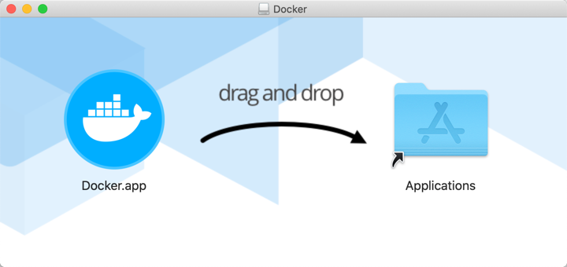

启动Docker，第一次启动可能需要你输入当前mac用户的密码。

打开终端，输入`docker version`命令，检查Docker环境是否正确安装。

```bash
Last login: Fri Dec 13 23:37:16 on console
kevin@KevindeMacBook-Pro ~ % docker version
Client: Docker Engine - Community
 Version:           19.03.5
 API version:       1.40
 Go version:        go1.12.12
 Git commit:        633a0ea
 Built:             Wed Nov 13 07:22:34 2019
 OS/Arch:           darwin/amd64
 Experimental:      false

Server: Docker Engine - Community
 Engine:
  Version:          19.03.5
  API version:      1.40 (minimum version 1.12)
  Go version:       go1.12.12
  Git commit:       633a0ea
  Built:            Wed Nov 13 07:29:19 2019
  OS/Arch:          linux/amd64
  Experimental:     true
 containerd:
  Version:          v1.2.10
  GitCommit:        b34a5c8af56e510852c35414db4c1f4fa6172339
 runc:
  Version:          1.0.0-rc8+dev
  GitCommit:        3e425f80a8c931f88e6d94a8c831b9d5aa481657
 docker-init:
  Version:          0.18.0
  GitCommit:        fec3683
kevin@KevindeMacBook-Pro ~ % 
```

Docker Hub 提供众多镜像，我们可以从中自由地下载数十万计的免费应用镜像， 这些镜像作为 docker 生态圈的基石，是我们使用和学习 docker 不可或缺的资源。但是，在国内访问Docker Hub速度较慢，为Docker添加国内镜像源，可以非常有效地提高镜像的下载速度。

当前比较快的国内镜像源推荐`http://hub-mirror.c.163.com`。

打开Docker的首选项。

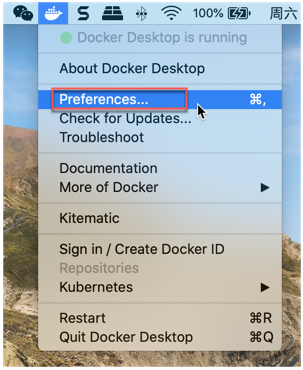

添加国内镜像源，然后"Apply & Restart"。

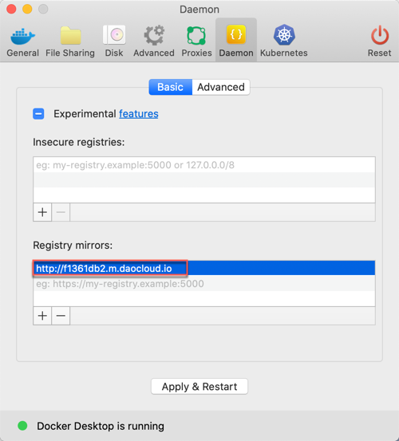

在 Windows 版本的 Docker Desktop 中配置国内镜像源，参考下图：

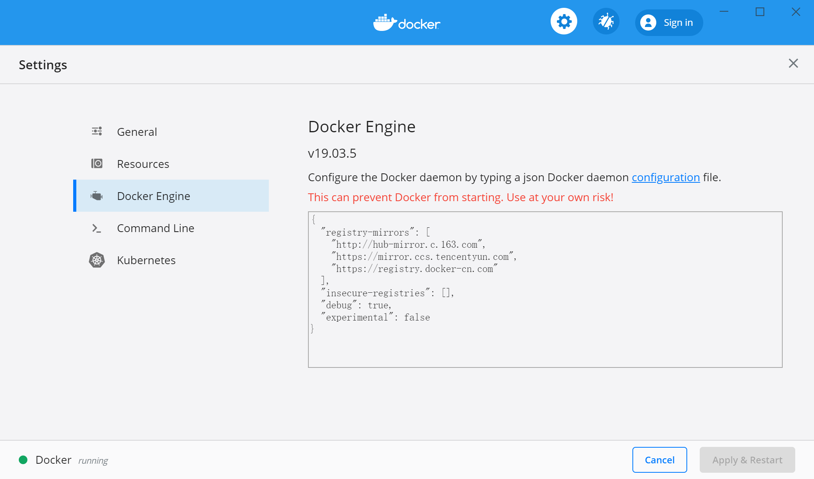

```json
{
  "registry-mirrors": [
    "http://hub-mirror.c.163.com",
    "https://mirror.ccs.tencentyun.com",
    "https://registry.docker-cn.com"
  ],
  "insecure-registries": [],
  "debug": true,
  "experimental": false
}
```

打开终端，输入`docker pull nginx`命令，拉取nginx镜像，测试下载速度。

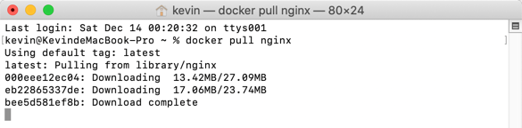

## A3.3 使用

在日常管理使用Docker的过程中，常用的Docker命令有镜像的拉取、创建、删除，容器的创建、启动、停止、删除等。

### A3.3.1 拉取镜像

当我们需要某一镜像时，可以去官方“**Docker hub**”：[https://registry.hub.docker.com](https://registry.hub.docker.com)上查找需要的镜像，然后使用命令`docker pull IMAGE_NAME `拉取镜像。

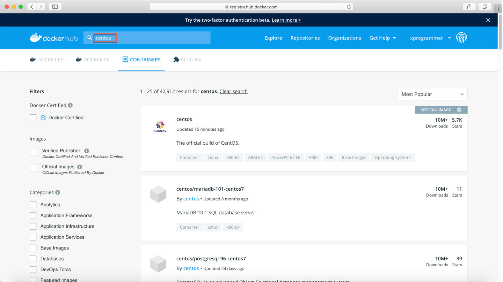

### A3.3.2 查看镜像

使用命令`docker images`查看当前宿主机上的容器。

如下图，可以看到刚才拉取下来的centos镜像。

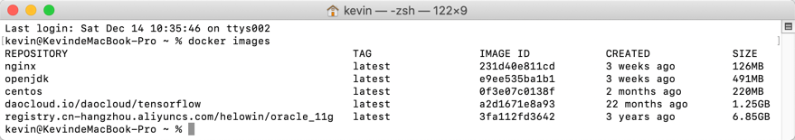

### A3.3.3 删除镜像

使用命令`docker rmi IMAGE_NAME/IMAGE_ID`删除镜像，例如`docker rmi 3fa112fd3642`删除3年前下载的“registry.cn-hangzhou.aliyuncs.com/helowin/oracle_11g”镜像。

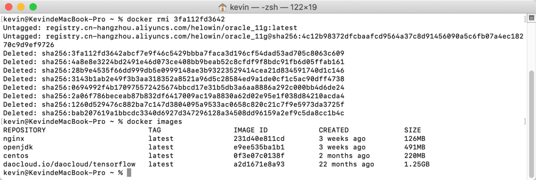

### A3.3.4 创建起停容器

使用命令`docker run xxx`创建并运行容器。

```bash
docker run --name SpringBootCourseRedis -p 6379:6379 -v ~/data:/data -d redis

启动参数说明：
--name：指定容器别名，指定后可直接通过别名操作该容器
-p：将容器端口与本地端口进行映射，冒号前边为本地端口，后边的为容器端口
-v： 将本地目录映射到容器目录，这里将本机用户目录～/data映射到容器中的/data
-d：后台运行
最后的参数'redis'是镜像名称
前置条件：本机已经通过'docker pull redis'下载了redis镜像
```

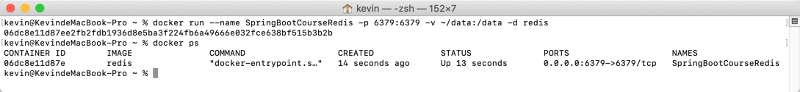

使用命令`docker stop container_name/container_id`停止容器。

使用命令`docker start container_name/container_id`启动容器。

使用命令`docker restart container_name/container_id`重启容器。

### A3.3.5 查看容器

使用命令`docker ps`查看当前运行的容器，使用`docker ps -a`查看宿主机上的所有容器（包含创建后停止的，没有运行的容器）。

### A3.3.6 删除容器

使用命令`docker rm container_name/container_id`删除容器。

## A3.4 集成

创建Spring Boot项目，在其pom依赖中添加Dockerfile Maven Plugin插件。

```xml
<plugin>
  <groupId>com.spotify</groupId>
  <artifactId>dockerfile-maven-plugin</artifactId>
  <version>1.4.13</version>
  <configuration>
    <repository>springboot-docker</repository>
    <contextDirectory>./</contextDirectory>
    <tag>${project.version}</tag>
    <buildArgs>
      <JAR_FILE>target/${project.build.finalName}.jar</JAR_FILE>
    </buildArgs>
  </configuration>
</plugin>
```

在项目根目录（和pom.xml同一目录）下创建Dockerfile文件，内容如下：

```
# 基础镜像
FROM openjdk:8
# 对应pom.xml文件中的dockerfile-maven-plugin插件buildArgs配置项JAR_FILE的值
ARG JAR_FILE
# 复制打包完成后的jar文件到/opt目录下
COPY ${JAR_FILE} /opt/app.jar
# 启动容器时执行
ENTRYPOINT ["java","-Djava.security.egd=file:/dev/./urandom","-jar","/opt/app.jar"]
# 使用8080端口
EXPOSE 8080
```

修改启动类，在其上添加一个用户交互地址`/docker/hello`用来测试程序是否正确运行。

```java
package com.example.docker;

import org.springframework.boot.SpringApplication;
import org.springframework.boot.autoconfigure.SpringBootApplication;
import org.springframework.web.bind.annotation.RequestMapping;
import org.springframework.web.bind.annotation.RestController;

@RestController
@RequestMapping("/docker/")
@SpringBootApplication
public class SpringBookDockerApplication {

	public static void main(String[] args) {
		SpringApplication.run(SpringBookDockerApplication.class, args);
	}
	
	@RequestMapping("/hello")
	public String hello() {
		return "Hello Docker.";
	}

}
```

在STS中运行maven构建任务。

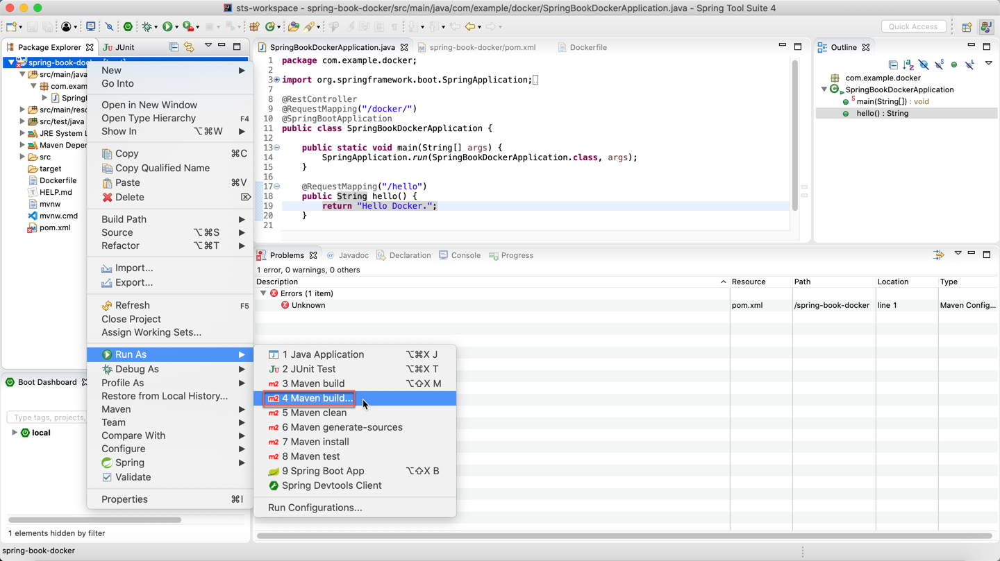

构建目标为`clean package dockerfile:build`，可以选择跳过测试。

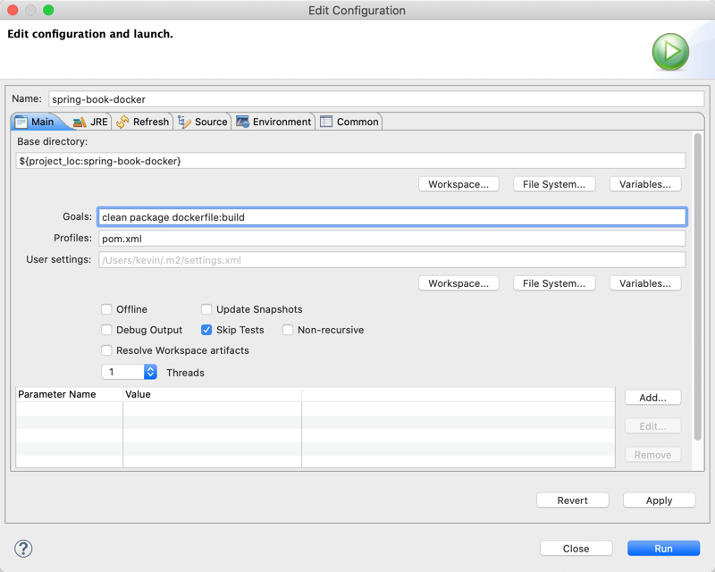

构建成功后使用命令`docker images`检查构建的镜像。

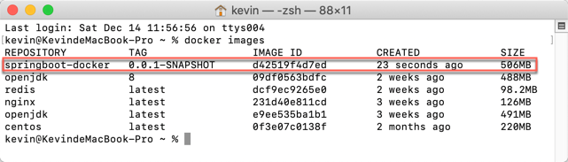

使用springboot-docker镜像创建并运行容器。

```bash
docker run --name SpringBootDockerHello -p 8080:8080 springboot-docker:0.0.1-SNAPSHOT
```

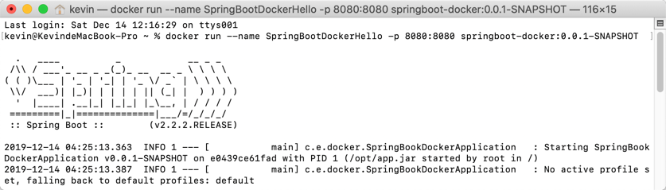

打开浏览球，访问[http://localhost:8080/docker/hello](http://localhost:8080/docker/hello)地址，检查Docker容器是否正常工作。

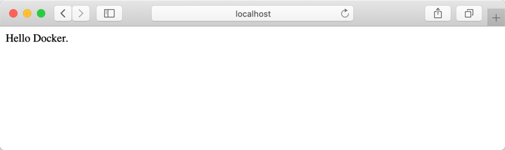

> 本小节示例项目代码：
>
> [https://github.com/gyzhang/SpringBootCourseCode/tree/master/spring-boot-docker](https://github.com/gyzhang/SpringBootCourseCode/tree/master/spring-boot-docker)

