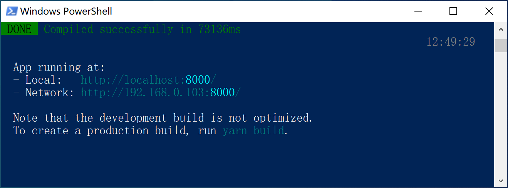
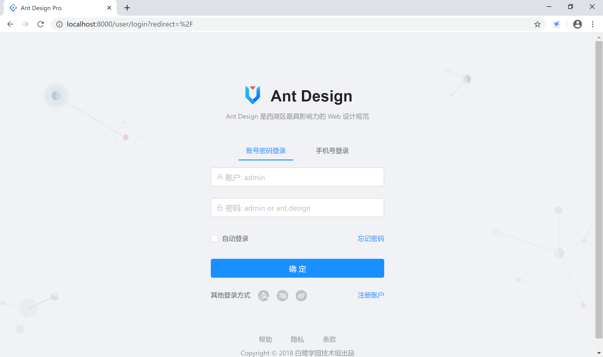
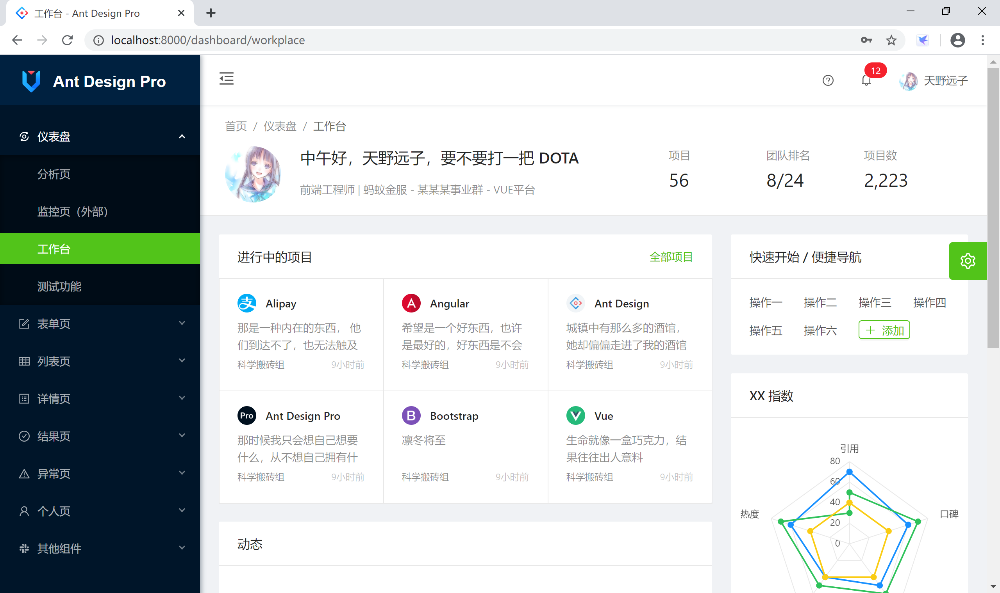
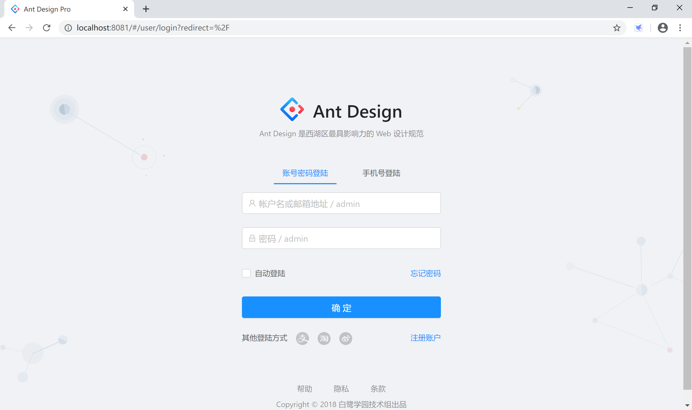
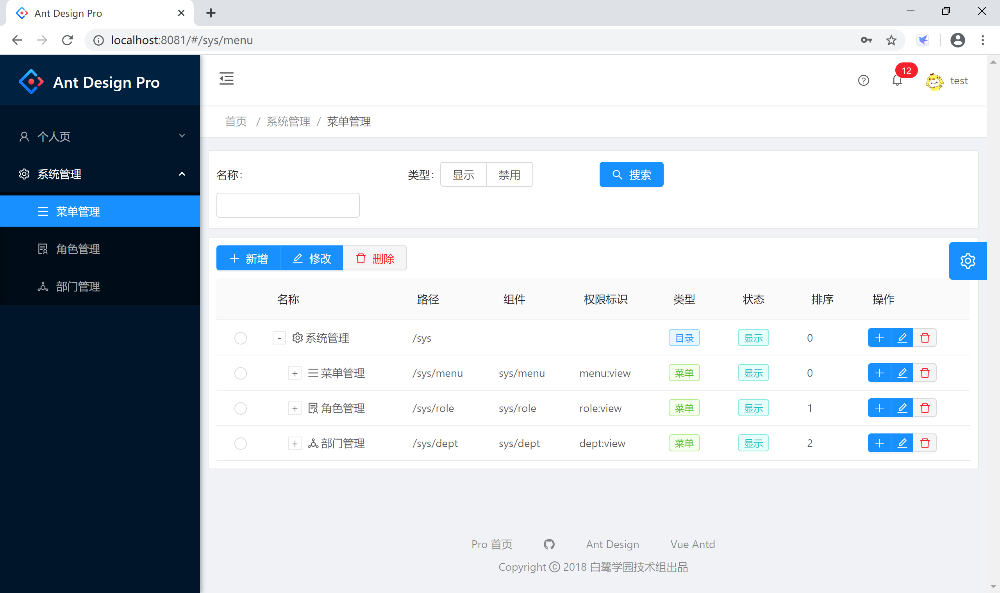

# A4 开始开发你的前后端分离应用

通过前面的学习，我们基本可以使用 Spring Boot 来构建管理类系统的后端服务了。

但是，前后端分离系统的前端呢？

我们在“**附录1 前后端分离的vue急速入门**”中提到 Vue 是一个非常不错的选择：使用起来相当顺手，当前社区热情高涨，国内资源丰富。是开发前端的一个好选择。

但是，漂亮的前端，哪里有呢？

[Ant Design Pro Vue](https://pro.loacg.com/) 是一个漂亮的，开箱即用的中台前端/设计解决方案，非常适合用来做企业管理系统的前端。

> Ant Design Pro 是一个企业级中后台前端/设计解决方案，我们秉承 [Ant Design](http://ant.design/) 的设计价值观，致力于在设计规范和基础组件的基础上，继续向上构建，提炼出典型模板/业务组件/配套设计资源，进一步提升企业级中后台产品设计研发过程中的『用户』和『设计者』的体验。随着『设计者』的不断反馈，我们将持续迭代，逐步沉淀和总结出更多设计模式和相应的代码实现，阐述中后台产品模板/组件/业务场景的最佳实践，也十分期待你的参与和共建。
>
> 官方源码库在：[https://gitee.com/sendya/ant-design-pro-vue/](https://gitee.com/sendya/ant-design-pro-vue/)

官方文档提及：基于上述目标和提供了以下的典型模板，并据此构建了一套基于 [Ant Design Vue](https://vue.ant.design/) 的中后台管理控制台的脚手架，她几乎完全和 react 相同布局，它可以帮助你快速搭建企业级中后台产品原型。

```
- Dashboard
  - 分析页
  - 监控页
  - 工作台
- 表单页
  - 基础表单页
  - 分步表单页
  - 高级表单页
- 列表页
  - 查询表格
  - 标准列表
  - 卡片列表
  - 搜索列表（项目/应用/文章）
- 详情页
  - 基础详情页
  - 高级详情页
- 结果
  - 成功页
  - 失败页
- 异常
  - 403 无权限
  - 404 找不到
  - 500 服务器出错
- 个人页
  - 个人中心
  - 个人设置
- 帐户
  - 登录
  - 注册
  - 注册成功
```

## A4.1 安装

我们要使用 Ant Design Pro Vue 需要在本地环境需安装 [node](http://nodejs.org/) 和 [git](https://git-scm.com/)。其技术栈基于 [ES2015+](http://es6.ruanyifeng.com/)、[Vue.Js](https://vuejs.org/)、[Vuex](https://vuex.vuejs.org/)、[Vue-Router](https://router.vuejs.org/)、[g2](https://antv.alipay.com/zh-cn/g2/3.x/index.html) 和 [antd-vue](https://vue.ant.design/docs/vue/introduce-cn/)，提前了解和学习这些知识会非常有帮助。

到 [node.js](https://nodejs.org/en/) 官网下载最新版的 [node-v12.16.0-x64.msi](https://nodejs.org/dist/v12.16.0/node-v12.16.0-x64.msi) 并安装。

然后，下载安装 [yarn](https://yarnpkg.com/) 官网下载最[新版的安装文件](https://classic.yarnpkg.com/latest.msi)并安装。

安装完 yarn 后，使用国内淘宝镜像库，加快速度。

```
yarn config set registry https://registry.npm.taobao.org
```

通过如下命令，使用远程 github 仓库创建前端脚手架项目。

```powershell
git clone --depth=1 https://github.com/sendya/ant-design-pro-vue.git ant-pro-vue
```
其目录结构如下：

```bash
├── public
│   └── logo.png             # LOGO
|   └── index.html           # Vue 入口模板
├── src
│   ├── api                  # Api ajax 等
│   ├── assets               # 本地静态资源
│   ├── config               # 项目基础配置，包含路由，全局设置
│   ├── components           # 业务通用组件
│   ├── core                 # 项目引导, 全局配置初始化，依赖包引入等
│   ├── router               # Vue-Router
│   ├── store                # Vuex
│   ├── utils                # 工具库
│   ├── locales              # 国际化资源
│   ├── views                # 业务页面入口和常用模板
│   ├── App.vue              # Vue 模板入口
│   └── main.js              # Vue 入口 JS
│   └── permission.js        # 路由守卫(路由权限控制)
├── tests                    # 测试工具
├── README.md
└── package.json
```

执行如下命令，启动前端应用。

```powershell
cd .\ant-pro-vue\
yarn install
yarn run serve
```



打开浏览器，访问 [http://localhost:8000/](http://localhost:8000/) 地址，可以检查前端应用是否启动。



输入用户名 admin 密码 ant.design 登录系统，主页工作台效果如下：



## A4.2 整合

前端和后端根本无所谓整合，但是我们在实际应用中，任何前端应用都会和后端服务连接起来。

我们经历过的每一个管理类系统（后管系统，后台管理系统），都是从基于 RBAC 的用户、角色、菜单、权限等系统管理功能开始的。我这里权且将这样的后管系统叫做“最小”系统。

要构建这样一个“最小”系统，需要使用到本教程中前面学习到的：

- Spring Web：通过 REST 向前端提供服务；
- MyBatis：访问数据库；
- Spring Security：安全管理；

在 github 上，[https://github.com/fwing1987/KKing](https://github.com/fwing1987/KKing) 这个仓库提供了一个前后端分离的权限管理系统：

- 前端：Ant Design Pro Vue；
- 后端：Spring Boot
  - Spring Web
  - MyBatis
  - PageHelper
  - Cache
  - Redis
  - Swagger2
  - Shiro

从 github 上克隆版本库后，MySQL 创建数据库并导入 KKing\sql\sys.sql 文件后，导入后端项目，修改配置文件 /admin/src/main/resources/application.yaml 中的数据库连接，启动本机 Redis 服务器。

启动 /admin/src/main/java/com/kking/admin/AdminApplication.java 主文件类，后端在 8080 端口提供服务。

进入前端应用存储目录，首先输入 `yarn install` 命令安装项目的依赖文件。然后输入 `yarn run serve` 启动开发服务器，前端应用在 [http://localhost:8081/](http://localhost:8081/) 提供服务，并连接到由后台 [http://localhost:8080/](http://localhost:8080/) 为前端提供的服务。

输入用户名 admin 和密码 admin 登录系统。



登录后，系统默认页面是菜单管理。



以这个项目开始，我们就可以学习构建自己的企业管理类系统了。

## A4.3 起步

如果使用上面的“最小”系统来构建我们的应用，还是有大量的工作要做。

有没有更好的“开源”选择呢？

有！

[https://github.com/zhangdaiscott/jeecg-boot](https://github.com/zhangdaiscott/jeecg-boot)