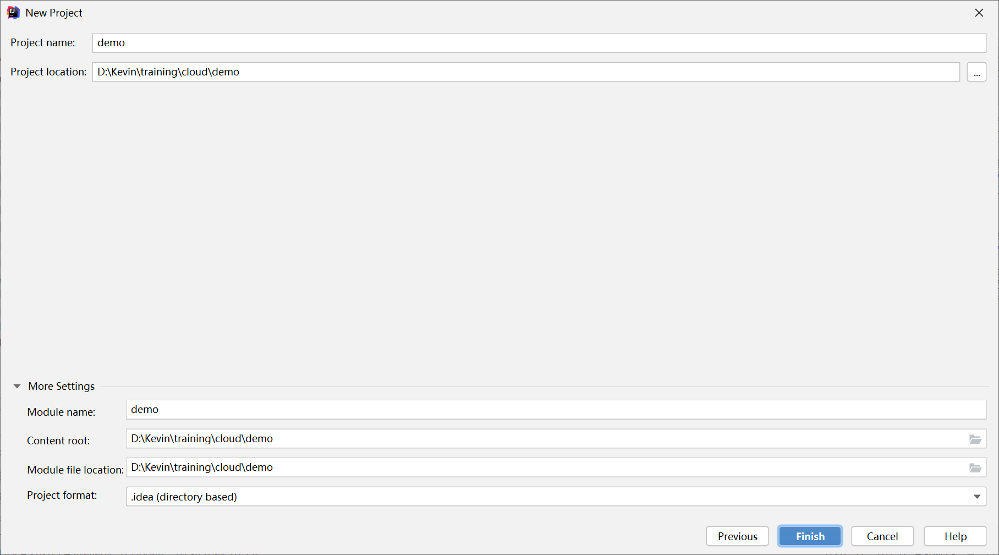

# 前进到 Spring Cloud

在学习完 Spring Boot 后，往前一步，我们一起走入 Spring Cloud 的世界。

> 用脚丈量过的地方，才不叫远方。
>
> 用手指敲过的代码，才能叫学过。

这是一份 Spring Cloud 的入门实验指南，使用了 Spring Boot 2.3.4.RELEASE 和 Spring Cloud Hoxton.SR8，其主要涉及到的分布式微服务组件有：

1. 服务注册中心：Eureka；
2. 负载均衡声明式调用：Feign；
3. 熔断器（在 Feign 中使用）：Hystrix；
4. 网关：Zuul；
5. 配置中心：Config；
6. 缓存：Redis；
7. 消息：RabbitMQ；

本指南剥离了业务场景，可做为最初始的 Spring Cloud 入门指导手册。

目的是从零开始搭建一个最基础的微服务脚手架。

## 1. 环境准备

### 1.1 安装 RabbitMQ

到官网下载最新的 [RabbitMQ 3.8.9](https://github.com/rabbitmq/rabbitmq-server/releases/download/v3.8.9/rabbitmq-server-3.8.9.exe)，对应的 Erlang 推荐使用 23.1 https://erlang.org/download/otp_win64_23.1.exe，然后安装。

安装测试文档，请参考 [Spring Boot 集成 RabbitMQ](https://xprogrammer.net/wiki/1349284033200160/1349646846788288)，请注意其中的版本变化。

启动安装程序：


选择安装目录：


打开命令提示符窗口，进入`C:\Program Files\RabbitMQ Server\rabbitmq_server-3.8.9\sbin`目录，执行`rabbitmq-plugins.bat enable rabbitmq_management` 开启Web管理插件。


打开浏览器访问[http://localhost:15672/](http://localhost:15672/)，使用guest用户，密码guest登录管理控制台，验证安装。


### 1.2 安装 Redis

在[https://github.com/microsoftarchive/redis/releases](https://github.com/microsoftarchive/redis/releases) 这里下载Windows预编译版本的Redis，为了简便起见，我们选择解压包文件。

安装测试文档，请参照[ Redis 简介](https://xprogrammer.net/wiki/1349284033200160/1349646836303552)。


下载后，将其解压到用户目录中，例如`C:\Users\Kevin\Redis-x64-3.2.100`。

双击`redis-server.exe`运行Redis服务器，可以看到Redis服务在6379端口上已经开放了。


### 1.3 安装 Consul

到[官网](https://www.consul.io/)下载 Windows 版本的 [Consul](https://releases.hashicorp.com/consul/1.8.5/consul_1.8.5_windows_amd64.zip)，解压 consul.exe 到指定的文件夹下。

创建 startup.bat 文件，以单节点方式启动，内容为：

```bash
consul.exe agent -dev -ui -client 0.0.0.0
```

打开浏览器，访问 [http://localhost:8500/](http://localhost:8500/) 地址，查看 Consul 的管理控制台：


## 2. 新建项目

使用 Spring Initializr 创建一个新项目 demo，选择 Spring Boot 版本和 Spring Cloud 的任一组件。

选择 Spring Initializr 向导：


填写项目信息，需要注意的是 Maven 的 Artifact 信息：


选择 Eureka Server 依赖：


确认 Maven 模块信息：



创建项目后，修改项目的 pom.xml 文件，其内容如下：

```xml
<?xml version="1.0" encoding="UTF-8"?>
<project xmlns="http://maven.apache.org/POM/4.0.0" xmlns:xsi="http://www.w3.org/2001/XMLSchema-instance"
         xsi:schemaLocation="http://maven.apache.org/POM/4.0.0 https://maven.apache.org/xsd/maven-4.0.0.xsd">
    <modelVersion>4.0.0</modelVersion>
    <parent>
        <groupId>org.springframework.boot</groupId>
        <artifactId>spring-boot-starter-parent</artifactId>
        <version>2.3.4.RELEASE</version>
        <relativePath/> <!-- lookup parent from repository -->
    </parent>
    <groupId>com.example</groupId>
    <artifactId>demo</artifactId>
    <version>0.0.1-SNAPSHOT</version>
    <name>demo</name>
    <packaging>pom</packaging>
    <description>Demo project for Spring Cloud</description>

    <properties>
        <java.version>1.8</java.version>
        <spring-cloud.version>Hoxton.SR8</spring-cloud.version>
    </properties>

    <dependencies>
        <dependency>
            <groupId>org.springframework.boot</groupId>
            <artifactId>spring-boot-starter-test</artifactId>
            <scope>test</scope>
            <exclusions>
                <exclusion>
                    <groupId>org.junit.vintage</groupId>
                    <artifactId>junit-vintage-engine</artifactId>
                </exclusion>
            </exclusions>
        </dependency>
    </dependencies>

    <dependencyManagement>
        <dependencies>
            <dependency>
                <groupId>org.springframework.cloud</groupId>
                <artifactId>spring-cloud-dependencies</artifactId>
                <version>${spring-cloud.version}</version>
                <type>pom</type>
                <scope>import</scope>
            </dependency>
        </dependencies>
    </dependencyManagement>

    <build>
        <plugins>
            <plugin>
                <groupId>org.springframework.boot</groupId>
                <artifactId>spring-boot-maven-plugin</artifactId>
            </plugin>
        </plugins>
    </build>

</project>
```

在项目的 pom.xml 文件中保留 test 和 plugin 配置，maven 项目打包类型修改为 pom 即可。

然后删除掉项目的源码目录 src，项目结构如下：


本实验的后续微服务将以 maven module 的形式创建在 demo 项目下。

### 2.1 服务注册中心

在 demo 项目中新建服务注册中心 eureka：


新建 module：


选择服务组件依赖：


确认项目文件保存位置：


在其 pom.xml 中依赖就是 eureka-server：

```xml
<dependency>
    <groupId>org.springframework.cloud</groupId>
    <artifactId>spring-cloud-starter-netflix-eureka-server</artifactId>
</dependency>
```

服务注册中心 Eureka 没有实际代码，主要信息在其配置文件 application.yml 中：

```yaml
spring:
  application:
    name: eureka-server
server:
  port: 8761
eureka:
  instance:
    hostname: localhost
  client:
    register-with-eureka: false
    fetch-registry: false
    service-url:
      default-zone: http://${eureka.instance.hostname}:${server.port}/eureka/
```

启动类 EurekaApplication 中需要添加 @EnableEurekaServer 注解：

```java
@SpringBootApplication
@EnableEurekaServer
public class EurekaApplication {

    public static void main(String[] args) {

        SpringApplication.run(EurekaApplication.class, args);
    }

}
```

### 2.2 配置中心

在 demo 项目中新建配置中心 config 服务：


选择依赖的组件：


在其 pom.xml 中的依赖是：

```xml
<dependency>
    <groupId>org.springframework.cloud</groupId>
    <artifactId>spring-cloud-config-server</artifactId>
</dependency>
<dependency>
    <groupId>org.springframework.cloud</groupId>
    <artifactId>spring-cloud-starter-netflix-eureka-client</artifactId>
</dependency>
```

配置中心也几乎没有代码，主要是配置信息：

```yaml
server:
  port: 9090
spring:
  application:
    name: service-config-server
  cloud:
    config:
      server:
        native:
          search-locations: classpath:/shared
  profiles:
    active: native
eureka:
  client:
    service-url:
      default-zone: http://localhost:8761/eureka/
```

在 classpath:/shared/service-member-dev.yml 文件中对后续的会员服务提供配置信息：

```yaml
server:
  port: 7091
spring:
  application:
    name: service-member
eureka:
  client:
    service-url:
      default-zone: http://localhost:8761/eureka/
```

在启动类 ConfigApplication 中添加 @EnableConfigServer 注解：

```java
@SpringBootApplication
@EnableConfigServer
public class ConfigApplication {

    public static void main(String[] args) {

        SpringApplication.run(ConfigApplication.class, args);
    }
}
```

### 2.3 会员服务

在 demo 项目中新建会员 member 服务：


选择依赖的组件：


在其 pom.xml 中的依赖如下，注意其中的 spring-cloud-config-client 这个依赖是连接到配置中心的关键：

> 后续根据需要还要添加其他依赖。

```xml
<dependency>
    <groupId>org.springframework.boot</groupId>
    <artifactId>spring-boot-starter-web</artifactId>
</dependency>
<dependency>
    <groupId>org.springframework.cloud</groupId>
    <artifactId>spring-cloud-starter-netflix-eureka-client</artifactId>
</dependency>
<dependency>
    <groupId>org.springframework.cloud</groupId>
    <artifactId>spring-cloud-config-client</artifactId>
</dependency>
```

在其配置文件 bootstrap.yml 中添加到配置中心的配置信息：

> 必须是 bootstrap.yml 文件，而不能是 application.yml，具体原因参考“背景知识”一节。

```yaml
spring:
  application:
    name: service-member
  cloud:
    config:
      discovery:
        enabled: true
        service-id: SERVICE-CONFIG-SERVER
      fail-fast: true
  profiles:
    active: dev
eureka:
  client:
    service-url:
      default-zone: http://localhost:8761/eureka/
```

添加 HelloController 控制器类，在其中添加 hello 方法，输出测试信息：

```java
@RestController
public class HelloController {
    @RequestMapping("/hello")
    public String hello(String name){
        return "Hello " + name + ". From Member.";
    }
}
```

启动注册中心、配置中心和会员服务，访问地址[http://localhost:7091/hello?name=Kevin](http://localhost:7091/hello?name=Kevin)， 测试会员服务是否可以正常加载配置中心的配置信息（请检查端口7091）：


### 2.4 网关

在 demo 项目中新建网关 zuul 服务：


选择依赖的组件：


在其 pom.xml 中的依赖是：

```xml
<dependency>
    <groupId>org.springframework.cloud</groupId>
    <artifactId>spring-cloud-starter-netflix-eureka-client</artifactId>
</dependency>
<dependency>
    <groupId>org.springframework.cloud</groupId>
    <artifactId>spring-cloud-starter-netflix-zuul</artifactId>
</dependency>
```

网关服务中主要是配置信息和过滤器类，其配置信息如下：

```yaml
server:
  port: 9000
spring:
  application:
    name: service-zuul
eureka:
  client:
    service-url:
      default-zone: http://localhost:8761/eureka/
zuul:
  routes:
    api:
      path: /api/member/**
      serviceId: SERVICE-MEMBER
  prefix: /v5.25
```

在其启动类中添加 @EnableZuulProxy 注解，开启网关服务：

```java
@SpringBootApplication
@EnableEurekaClient
@EnableZuulProxy
public class ZuulApplication {

    public static void main(String[] args) {

        SpringApplication.run(ZuulApplication.class, args);
    }
}
```

为了演示网关过滤器的用法，新建 MyTokenFilter 类，覆盖 run 方法：

> 本过滤器演示了一种权限的控制方法：请求中是否具有 token 变量。

```java
@Component
public class MyTokenFilter extends ZuulFilter {
    Logger logger = LoggerFactory.getLogger(MyTokenFilter.class);

    @Override
    public String filterType() {
        return PRE_TYPE;
    }

    @Override
    public int filterOrder() {
        return 0;
    }

    @Override
    public boolean shouldFilter() {
        return true;
    }

    @Override
    public Object run() throws ZuulException {
        RequestContext context = RequestContext.getCurrentContext();
        HttpServletRequest request = context.getRequest();
        Object accessToken = request.getParameter("token");
        if (accessToken == null){
            logger.error("错误：没有访问令牌。");
            context.setSendZuulResponse(false);
            context.setResponseStatusCode(401);
            try {
                HttpServletResponse response = context.getResponse();
                response.setCharacterEncoding("GBK");
                response.getWriter().write("错误：没有访问令牌。");
            } catch (IOException e) {
                e.printStackTrace();
            }
        }
        return null;
    }
}
```

在启动服务注册中心、配置中心和会员服务的情况下，启动网关访问地址[http://localhost:9000/v5.25/api/member/hello?name=Kevin&token=Zhang](http://localhost:9000/v5.25/api/member/hello?name=Kevin&token=Zhang)， 测试网关（端口9000）是否可以正常返回会员服务的测试接口：


访问不带token的地址[http://localhost:9000/v5.25/api/member/hello?name=Kevin](http://localhost:9000/v5.25/api/member/hello?name=Kevin)， 测试网关中的过滤器是否正常工作：


### 2.5 应用控制台

在 demo 项目中新建应用控制台 console 服务：


选择依赖的组件：


在其 pom.xml 中的依赖是：

```xml
<dependency>
    <groupId>org.springframework.boot</groupId>
    <artifactId>spring-boot-starter-thymeleaf</artifactId>
</dependency>
<dependency>
    <groupId>org.springframework.boot</groupId>
    <artifactId>spring-boot-starter-web</artifactId>
</dependency>
<dependency>
    <groupId>org.springframework.cloud</groupId>
    <artifactId>spring-cloud-starter-netflix-eureka-client</artifactId>
</dependency>
<dependency>
    <groupId>org.springframework.cloud</groupId>
    <artifactId>spring-cloud-starter-openfeign</artifactId>
</dependency>
```

console 服务的配置是一个典型的 Spring Boot Web 项目，但是打开了 hystrix 的熔断处理：

```yaml
server:
  port: 8080
spring:
  application:
    name: service-console
eureka:
  client:
    service-url:
      default-zone: http://localhost:8761/eureka/
feign:
  hystrix:
    enabled: true
```

在其启动类 ConsoleApplication 中，添加了 @EnableFeignClients 注解，打开 Feign 调用：

```java
@SpringBootApplication
@EnableEurekaClient
@EnableFeignClients
public class ConsoleApplication {

    public static void main(String[] args) {

        SpringApplication.run(ConsoleApplication.class, args);
    }
}
```

新建 Feign 调用 HelloClientFeign 接口，其中的 SERVICE-ZUUL 是网关的服务，fallback 是熔断器断开时的快速返回调用。hello 方法实质是调用了 zuul 网关之后 member 服务的 hello 方法：

```java
@FeignClient(value = "SERVICE-ZUUL", fallback = HelloClientHystrix.class)
public interface HelloClientFeign {
    @GetMapping(value = "/v5.25/api/member/hello")
    String hello(@RequestParam(value = "name") String name, @RequestParam(value = "token") String token);
}
```

创建一个 HelloClientHystrix 类，实现 HelloClientFeign 接口，为调用失败时返回对应的错误提示信息：

```java
@Component
public class HelloClientHystrix implements HelloClientFeign {
    @Override
    public String hello(String name, String token) {

        return "OOPS..." + name + ", SOMETHING IS WRONG!";
    }
}
```

新建一个服务类 HelloService，将 Feign 调用（远程）的接口 HelloClientFeign 注入：

```java
@Service
public class HelloService {
    @Autowired
    private HelloClientFeign helloClientFeign;

    public String hello(String name, String token){
        
        return helloClientFeign.hello(name, token);
    }
}
```

新建一个控制器 HelloController 类，注入 HelloService 服务类，为显示页面提供远程服务方法调用：

```java
@Controller
public class HelloController {
    @Autowired
    HelloService helloService;

    @RequestMapping("/hello")
    public ModelAndView hello(String name, String token) {
        ModelAndView mv = new ModelAndView();
        String sayHello = helloService.hello(name, token);
        mv.addObject("sayHello", sayHello);
        mv.addObject("accessToken", token);
        mv.setViewName("/hello");
        return mv;
    }
}
```

创建 hello.index 页面，显示 ModelAndView 中携带的数据：

```html
<!DOCTYPE html>
<html lang="en" xmlns:th="http：//www.thymeleaf.org">
<head>
    <meta charset="UTF-8">
    <title>你好，世界。</title>
</head>
<body>
    <div class="login">
        <h3>测试，测试：</h3>
        <p th:text="${sayHello}"/>
        <p th:text="${accessToken}"/>
    </div>
</body>
</html>
```

在正确启动网关的情况下，访问地址[http://localhost:8080/hello?name=Roy&token=Zhang](http://localhost:8080/hello?name=Roy&token=Zhang)， 测试应用控制台是否可以正常使用 Feign 访问网关的服务：


## 3. 扩展项目

在本小节里面，我们将基础的 Spring Cloud 项目扩展为一个最简单电商场景的应用，有如下特性或限制：

1. 使用 MySQL 数据库存储数据；
2. 使用 MyBatis 作为数据持久化框架；
3. 使用 MyBatisPlus 作为数据访问基础框架；
4. 从技术上集成 Redis 缓存，增减商品个数时同时往数据库和缓存中增减；
5. 从技术上集成 RabbitMQ 消息中间件，购买商品时通过消息通知仓库发货（日志输出信息表示发货）；
6. 为了集中学习焦点，选择的场景非常简单，并且和实际生活中的场景出入较大；
7. 包含两个微服务：会员和商品。订单服务请自行添加；
8. 在集成 RabbitMQ 的示例中直接在商品服务中添加了发货消息，从职责上划分并不合适。

### 3.1 集成 Redis

在会员（member）服务中添加 Redis 服务，以集成测试缓存 Redis。

> 限制：本实验中使用 Windows 版本的单机 Redis 进行演示。使用 Redis 集群，请参考[Redis集群](https://xprogrammer.net/wiki/1349284033200160/1349646838399936)。

在 pom.xml 文件中添加 Redis 依赖：

```xml
<dependency>
    <groupId>org.springframework.boot</groupId>
    <artifactId>spring-boot-starter-data-redis</artifactId>
</dependency>
```

在配置文件 bootstrap.yml 中添加连接到 Redis 的配置信息：

```yaml
spring:
  redis:
    database: 0
    host: localhost
    port: 6379
    password:
```

添加 HelloService 类，使用`org.springframework.data.redis.core.StringRedisTemplate`模板操作 Redis：

```java
@Service
public class HelloService {
    @Resource
    private StringRedisTemplate strTemplate;
    private Logger logger = LoggerFactory.getLogger(HelloService.class);

    public void testRedis(String name){
        strTemplate.opsForValue().set("name", name);
        String nameInRedis = strTemplate.opsForValue().get("name");
        logger.info("Name in Redis=" + nameInRedis);
    }    
}
```

在 HelloController 类中调用 HelloService 的 testRedis 方法，测试 Redis 是否可以正确使用：

```java
@RestController
public class HelloController {
    @Autowired
    private HelloService helloService;

    @RequestMapping("/hello")
    public String hello(String name){
        helloService.testRedis(name);
        return "Hello " + name + ". From Member.";
    }    
}
```

在 idea 的控制台中查看 HelloService.testRedis 方法输出的日志：

```verilog
2020-10-30 06:32:19.266  INFO 7152 --- [nio-7091-exec-3] com.example.member.service.HelloService  : Name in Redis=Roy
2020-10-30 06:33:51.009  INFO 7152 --- [nio-7091-exec-5] com.example.member.service.HelloService  : Name in Redis=Kevin
```

打开 Redis 的命令控制台（redis-cli.exe）输入命令`get name`，查看 Redis 中存放的键值对是否正确。


### 3.2 集成 RabbitMQ

在会员（member）服务中添加 RabbitMQ 服务，以集成测试消息中间件 RabbitMQ。

在 pom.xml 文件中添加 RabbitMQ 依赖：

```xml
<dependency>
    <groupId>org.springframework.boot</groupId>
    <artifactId>spring-boot-starter-amqp</artifactId>
</dependency>
```

在配置文件 bootstrap.yml 中添加连接到 RabbitMQ 的配置信息：

```yaml
spring:
  rabbitmq:
    host: 127.0.0.1
    port: 5672
    username: guest
    password: guest
    # 开启发送确认
    publisher-confirm-type: correlated
    # 开启发送失败退回
    publisher-returns: true
    # 开启ACK
    listener:
      direct:
        acknowledge-mode: manual
      simple:
        acknowledge-mode: manual
```

添加 RabbitMQConfig 配置类，创建一个消息队列：

```java
@Configuration
public class RabbitMQConfig {

    @Bean
    public Queue kevinQueue() {
        return new Queue("kevin");
    }
}
```

在 HelloService 类中添加 testRabbitMQ 方法，发送消息：

```java
public void testRabbitMQ(String name){
    String message = name + " is a GOODMAN.";
    amqpTemplate.convertAndSend("kevin", message);
    logger.info("Send Message: " + message);
}
```

创建消息消费者 RabbitMQConsumer 类，监听`kevin`消息队列的消息，并在管理控制台上输出接收到的消息：

```java
@Component
@RabbitListener(queues = "kevin")
public class RabbitMQConsumer {
    private Logger logger = LoggerFactory.getLogger(RabbitMQConsumer.class);

    @RabbitHandler
    public void receive(String msg) {
        logger.info("RabbitMQ Consumer consume message: " + msg);
    }
}
```

在 idea 的控制台中查看 HelloService 发送的消息和 RabbitMQConsumer 接受到的消息：

```verilog
2020-10-30 07:17:11.328  INFO 6160 --- [nio-7091-exec-2] com.example.member.service.HelloService  : Send Message: Kevin is a GOODMAN.
2020-10-30 07:17:11.331  INFO 6160 --- [ntContainer#0-1] c.e.member.service.RabbitMQConsumer      : RabbitMQ Consumer consume message: Kevin is a GOODMAN.
```

在 RabbitMQ 的 web 控制台中检查消息队列情况：


### 3.3 将项目进行扩展

作业：请将 Spring Boot 练习环节完成的单体电商购物代码，移植到 Spring Cloud 微服务架构。

注意：

1. 需要创建商品服务（product），订单服务（order）；
2. 所有和界面相关的内容，全部写在 console 服务中；
3. 会员服务（member），商品服务（product），订单服务（order）中不能出现 Thymeleaf 页面；
4. （可选）使用前后端分离技术（例如 vue）代替 console 服务。

## 4. 背景知识

application.yml 和 bootstrap.yml 在同一目录下：bootstrap.yml 先加载 application.yml 后加载。

bootstrap.yml 和 application.yml 都可以用来配置参数。

bootstrap.yml 用来程序引导时执行，应用于更加早期配置信息读取。可以理解成系统级别的一些参数配置，这些参数一般是不会变动的。一旦bootStrap.yml 被加载，则内容不会被覆盖。

application.yml 可以用来定义应用级别的， 应用程序特有配置信息，可以用来配置后续各个模块中需使用的公共参数等。

**bootstrap.yml典型的应用场景**

- 当使用 Spring Cloud Config Server 配置中心时，这时需要在 bootstrap.yml 配置文件中指定；spring.application.name 和 spring.cloud.config.server.git.uri，添加连接到配置中心的配置属性来加载外部配置中心的配置信息；
- 一些固定的不能被覆盖的属性；
- 一些加密/解密的场景。

## 5. 再进一步

在学习过程中，为了减少复杂性，我们使用了 Thymeleaf 模板技术，但是在实际的工作项目中，用得最多的是前后端分离架构体系。

在前后端分离架构中，国内用得最多的当属 [vue](https://cn.vuejs.org/)，其[官方文档](https://cn.vuejs.org/v2/guide/)就相当完善。

这里有一篇最最简单的[前后端入门](https://xprogrammer.net/article/1355071495340896)的文章，可以看一看。

在 vue 技术生态中 [element](https://element.eleme.cn/#/zh-CN) 组件是应用较为广泛的，其 [element-admin](https://panjiachen.github.io/vue-element-admin-site/zh/)，可以快速作为管理类项目的起始脚手架项目。

使用 element-admin 的开源项目 [pre-ui](https://github.com/LiHaodong888/pre-ui)（后台 Spring Boot 项目为 [pre](https://github.com/LiHaodong888/pre)）值得你认真学习。

更进一步，其分布式版本开源项目 [prex](https://gitee.com/kaiyuantuandui/prex)，更是值得你认真学习的一个好项目。

你认真学习的样子，真美。

> 配套代码请移步这里：[https://github.com/gyzhang/SpringCloudCourseCode/tree/master/spring-cloud-quickstart/demo](https://github.com/gyzhang/SpringCloudCourseCode/tree/master/spring-cloud-quickstart/demo)

Kevin，2020-10-30，北京。
